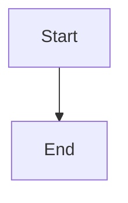

# Ödeal Payment Infrastructure - Mintlify Documentation

Comprehensive documentation for the Ödeal Payment Infrastructure built with Mintlify.

## 📚 What's Inside

This documentation covers the complete Ödeal Payment Infrastructure:

### Architecture & Design
- **System Architecture**: Complete technical architecture with diagrams
- **SDLC Workflow**: Development process and quality gates
- **Product Vision**: Business model and strategic goals
- **Epic Catalog**: All 23 epics across 3 phases
- **Roadmap**: Current status and future plans

### Features
- **Payment Flows**: Non-3D and 3D Secure implementations
- **Multi-Currency**: TRY, USD, EUR with DCC support
- **Marketplace**: Sub-merchants and split payments
- **3D Secure**: Complete integration guide
- **Pay by Link**: Payment link generation

### API Reference
- **Overview**: Base URLs, authentication, core resources
- **Authentication**: API key and HMAC signature implementation
- *(More endpoints coming soon)*

## 🚀 Quick Start

### Prerequisites
- Node.js 14+ 
- npm or yarn

### Install Mintlify CLI

```bash
npm install -g mintlify
```

### Run Development Server

```bash
cd mintlify-docs
mintlify dev
```

The documentation will be available at `http://localhost:3000`

## 📝 Documentation Structure

```
mintlify-docs/
├── mint.json                    # Navigation configuration
├── index.mdx                    # Homepage
├── quickstart.mdx               # Quick start guide
├── development.mdx              # Development setup
│
├── architecture/                # Architecture documentation
│   ├── overview.mdx            # System architecture
│   ├── sdlc.mdx                # SDLC workflow
│   ├── product-vision.mdx      # Product vision
│   ├── epic-catalog.mdx        # Epic catalog
│   └── roadmap.mdx             # Project roadmap
│
├── features/                    # Feature guides
│   ├── payment-flows.mdx       # Payment flows
│   ├── multi-currency.mdx      # Multi-currency
│   ├── marketplace.mdx         # Marketplace features
│   ├── 3ds-integration.mdx     # 3D Secure
│   ├── pay-by-link.mdx         # Pay by Link
│   └── split-payments.mdx      # Split payments
│
├── api-reference/               # API documentation
│   ├── overview.mdx            # API overview
│   └── authentication.mdx      # Authentication
│
├── guides/                      # Integration guides (placeholder)
└── essentials/                  # Best practices (existing)
```

## 🎨 Features

- ✅ **29 Pages** organized in 6 sections
- ✅ **7 Mermaid Diagrams** for visual clarity
- ✅ **Multi-language Examples** (JavaScript, Python, PHP, C#)
- ✅ **Interactive Navigation** 
- ✅ **Search Functionality**
- ✅ **Mobile Responsive**
- ✅ **Dark Mode Support**

## 🔧 Configuration

Key configuration in `mint.json`:
- Name: "Ödeal Payment Infrastructure"
- Theme: Mint (dark theme)
- Colors: Custom brand colors
- Navigation: 6 main groups

## 📖 Writing Documentation

### Adding a New Page

1. Create a new `.mdx` file in the appropriate directory
2. Add frontmatter:
```markdown
---
title: Your Page Title
description: Brief description
---
```
3. Add the page to `mint.json` navigation

### Using Components

Mintlify supports special components:

```markdown
<Card title="Title" icon="icon-name">
  Content
</Card>

<CardGroup cols={2}>
  <!-- Multiple cards -->
</CardGroup>

<Note>Important note</Note>
<Warning>Warning message</Warning>
<Tip>Helpful tip</Tip>
```

### Adding Diagrams

Use Mermaid for diagrams:

````markdown

````

## 🌐 Deployment

### Local Testing

```bash
mintlify dev
```

### Deploy to Mintlify

1. Push changes to repository
2. Connect repository to Mintlify dashboard
3. Mintlify auto-deploys on push

Or deploy manually:
```bash
mintlify deploy
```

## 📊 Documentation Coverage

| Section | Status | Pages |
|---------|--------|-------|
| Getting Started | ✅ Complete | 3 |
| Architecture | ✅ Complete | 5 |
| Features | ✅ Complete | 6 |
| API Reference | ⏳ Foundation | 2 |
| Guides | 📝 Planned | 4 |
| Essentials | ✅ Exists | 4 |

## 🎯 Next Steps

1. **Complete API Reference**: Add detailed endpoint documentation
2. **Add Integration Guides**: Step-by-step integration tutorials  
3. **Expand Examples**: More real-world code examples
4. **Test Local**: Verify all pages render correctly
5. **Deploy**: Push to Mintlify platform

## 🤝 Contributing

When adding documentation:
1. Follow existing structure and style
2. Include code examples in multiple languages where applicable
3. Add diagrams for complex flows
4. Test locally before committing
5. Update `mint.json` navigation

## 📞 Support

For documentation questions:
- Email: docs@odeal.com
- Technical Support: api-support@odeal.com

## 📄 License

This documentation is part of the Ödeal Payment Infrastructure project.
