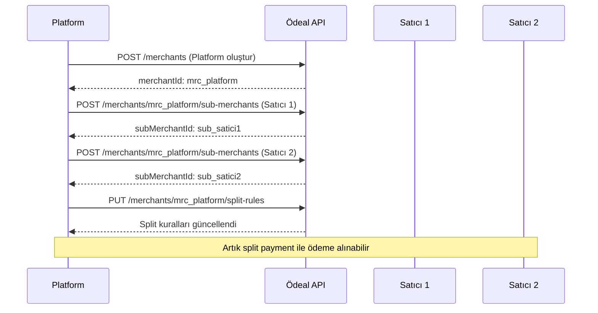

# Üye İşyeri API (Merchants API)

Üye işyerleri ve alt üye işyerleri oluşturma, güncelleme ve yönetme için kullanılan endpoint'ler.

## Üye İşyeri Oluşturma

### `POST /v1/merchants`

Yeni bir üye işyeri oluşturur.

```bash
POST /v1/merchants
Authorization: Bearer API_ANAHTARINIZ
Content-Type: application/json
```

#### İstek Gövdesi

```json
{
  "name": "Acme Teknoloji A.Ş.",
  "taxId": "1234567890",
  "email": "info@acme.com",
  "phone": "+905551234567",
  "address": {
    "street": "Atatürk Cad. No:123",
    "city": "İstanbul",
    "postalCode": "34000",
    "country": "TR"
  },
  "bankAccount": {
    "iban": "TR320006200011900000012345",
    "accountHolder": "Acme Teknoloji A.Ş."
  },
  "mcc": "5732",
  "url": "https://acme.com"
}
```

#### Parametreler

| Parametre | Tip | Zorunlu | Açıklama |
|-----------|-----|---------|----------|
| `name` | string | Evet | Üye işyeri adı |
| `taxId` | string | Evet | Vergi numarası (VKN) veya TCKN |
| `email` | string | Evet | E-posta adresi |
| `phone` | string | Evet | Telefon numarası |
| `address.street` | string | Evet | Açık adres |
| `address.city` | string | Evet | Şehir |
| `address.postalCode` | string | Evet | Posta kodu |
| `address.country` | string | Evet | Ülke kodu (TR) |
| `bankAccount.iban` | string | Evet | IBAN numarası |
| `bankAccount.accountHolder` | string | Evet | Hesap sahibi adı |
| `mcc` | string | Evet | MCC kategori kodu (4 haneli) |
| `url` | string | Hayır | Web sitesi |

#### Yanıt (201 Created)

```json
{
  "id": "mrc_abc123",
  "name": "Acme Teknoloji A.Ş.",
  "status": "Active",
  "merchantKey": "MCH_ABC123XYZ",
  "createdAt": "2025-12-19T18:30:00Z"
}
```

<Note>
**Vergi Numarası Doğrulama:**
- VKN: 10 haneli sayısal değer
- TCKN: 11 haneli sayısal değer (0 ile başlamaz)
</Note>

---

## Üye İşyeri Sorgulama

### `GET /v1/merchants/{id}`

Belirli bir üye işyerinin detaylarını getirir.

```bash
GET /v1/merchants/mrc_abc123
Authorization: Bearer API_ANAHTARINIZ
```

#### Yanıt

```json
{
  "id": "mrc_abc123",
  "name": "Acme Teknoloji A.Ş.",
  "taxId": "1234567890",
  "email": "info@acme.com",
  "phone": "+905551234567",
  "address": {
    "street": "Atatürk Cad. No:123",
    "city": "İstanbul",
    "postalCode": "34000",
    "country": "TR"
  },
  "status": "Active",
  "merchantKey": "MCH_ABC123XYZ",
  "isMarketplace": false,
  "createdAt": "2025-12-19T18:30:00Z"
}
```

### `GET /v1/merchants`

Tüm üye işyerlerini listeler.

```bash
GET /v1/merchants
Authorization: Bearer API_ANAHTARINIZ
```

#### Yanıt

```json
{
  "data": [
    {
      "id": "mrc_abc123",
      "name": "Acme Teknoloji A.Ş.",
      "status": "Active",
      "createdAt": "2025-12-19T18:30:00Z"
    },
    {
      "id": "mrc_def456",
      "name": "Beta Market",
      "status": "Active",
      "createdAt": "2025-12-18T10:00:00Z"
    }
  ],
  "total": 2
}
```

---

## Üye İşyeri Güncelleme

### `PUT /v1/merchants/{id}`

Mevcut bir üye işyerinin bilgilerini günceller.

```bash
PUT /v1/merchants/mrc_abc123
Authorization: Bearer API_ANAHTARINIZ
Content-Type: application/json
```

#### İstek Gövdesi

```json
{
  "id": "mrc_abc123",
  "name": "Acme Teknoloji A.Ş.",
  "email": "yeni_email@acme.com",
  "phone": "+905559876543"
}
```

#### Yanıt (200 OK)

```json
{
  "id": "mrc_abc123",
  "name": "Acme Teknoloji A.Ş.",
  "email": "yeni_email@acme.com",
  "phone": "+905559876543",
  "updatedAt": "2025-12-19T19:00:00Z"
}
```

---

## Üye İşyeri Silme

### `DELETE /v1/merchants/{id}`

Bir üye işyerini siler (soft delete).

```bash
DELETE /v1/merchants/mrc_abc123
Authorization: Bearer API_ANAHTARINIZ
```

#### Yanıt (204 No Content)

<Warning>
Üye işyeri silme işlemi geri alınamaz. Silinen üye işyerine ait geçmiş işlemler korunur ancak yeni işlem yapılamaz.
</Warning>

---

## Alt Üye İşyeri (Sub-Merchant) İşlemleri

### Alt Üye İşyeri Oluşturma

#### `POST /v1/merchants/{id}/sub-merchants`

Marketplace modeli için bir üye işyerinin altına yeni satıcı ekler.

```bash
POST /v1/merchants/mrc_abc123/sub-merchants
Authorization: Bearer API_ANAHTARINIZ
Content-Type: application/json
```

#### İstek Gövdesi

```json
{
  "name": "Satıcı XYZ",
  "taxId": "9876543210",
  "email": "satici@xyz.com",
  "phone": "+905551112233",
  "address": {
    "street": "İnönü Cad. No:45",
    "city": "Ankara",
    "postalCode": "06000",
    "country": "TR"
  },
  "bankAccount": {
    "iban": "TR980006200011900000054321",
    "accountHolder": "Satıcı XYZ"
  },
  "mcc": "5411"
}
```

#### Yanıt (201 Created)

```json
{
  "id": "sub_xyz789",
  "parentMerchantId": "mrc_abc123",
  "name": "Satıcı XYZ",
  "status": "Active",
  "subMerchantKey": "SUB_XYZ789",
  "createdAt": "2025-12-19T18:45:00Z"
}
```

<Tip>
**Marketplace Hiyerarşisi:** 
Alt üye işyerleri recursive olarak desteklenir. Bir alt üye işyeri, kendi alt satıcılarını oluşturabilir (maksimum 5 seviye derinlik).
</Tip>

---

## Split Payment Kuralları

### Split Kurallarını Güncelleme

#### `PUT /v1/merchants/{id}/split-rules`

Bir üye işyeri için ödeme dağıtım kurallarını günceller.

```bash
PUT /v1/merchants/mrc_abc123/split-rules
Authorization: Bearer API_ANAHTARINIZ
Content-Type: application/json
```

#### İstek Gövdesi

```json
{
  "rules": [
    {
      "type": "percentage",
      "value": 15.0,
      "recipientId": "mrc_abc123",
      "description": "Platform komisyonu"
    },
    {
      "type": "percentage",
      "value": 85.0,
      "recipientId": "sub_xyz789",
      "description": "Satıcı hakkı"
    }
  ]
}
```

#### Parametreler

| Parametre | Tip | Açıklama |
|-----------|-----|----------|
| `type` | string | `percentage` veya `fixed` |
| `value` | decimal | Yüzde (0-100) veya sabit tutar |
| `recipientId` | string | Alıcı merchant ID |
| `description` | string | Kural açıklaması |

#### Yanıt (200 OK)

```json
{
  "merchantId": "mrc_abc123",
  "rules": [
    {
      "type": "percentage",
      "value": 15.0,
      "recipientId": "mrc_abc123"
    },
    {
      "type": "percentage",
      "value": 85.0,
      "recipientId": "sub_xyz789"
    }
  ],
  "updatedAt": "2025-12-19T19:10:00Z"
}
```

<Note>
Split kuralları toplamı %100'e eşit olmalıdır (percentage tipi için).
</Note>

---

## Durum Kodları

| Durum | Açıklama |
|-------|----------|
| `Active` | Aktif - İşlem yapabilir |
| `Suspended` | Askıya alınmış - İşlem yapamaz |
| `Passive` | Pasif - Devre dışı |
| `PendingApproval` | Onay bekliyor |

---

## MCC Kodları (Örnekler)

| MCC | Kategori |
|-----|----------|
| `5411` | Süpermarket, Market |
| `5732` | Elektronik Mağazaları |
| `5812` | Restoran ve Yemek Servisi |
| `5999` | Çeşitli Perakende |
| `7011` | Otel ve Konaklama |
| `7298` | Sağlık ve Güzellik |

<Tip>
Tam MCC listesi için [MCC Kodları Tablosu](#) sayfasını inceleyebilirsini.
</Tip>

---

## Hata Kodları

| Kod | Açıklama | Çözüm |
|-----|----------|--------|
| `INVALID_TAX_ID` | Geçersiz vergi numarası | VKN/TCKN formatı kontrol edilsin |
| `DUPLICATE_MERCHANT` | Aynı vergi numarasıyla kayıt mevcut | Mevcut kayıt kullanılsın |
| `INVALID_MCC` | Geçersiz MCC kodu | Geçerli 4 haneli MCC girilsin |
| `INVALID_IBAN` | Geçersiz IBAN | IBAN formatı ve TR başlangıcı kontrol edilsin |
| `MERCHANT_NOT_FOUND` | Üye işyeri bulunamadı | ID doğruluğu kontrol edilsin |

---

## Marketplace Örnek Akışı



---

## İlgili Kaynaklar

- [Marketplace Özellikleri](/features/marketplace)
- [Split Payments](/features/split-payments)
- [Ödeme API](/api-reference/payments)
