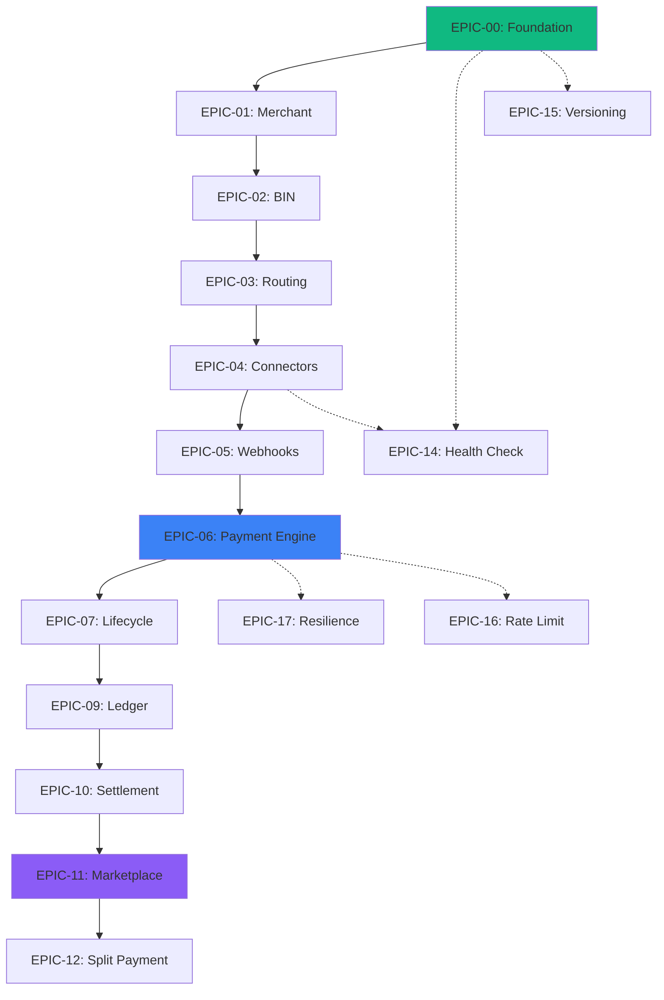

# Epic Catalog

Complete catalog of epics for the Ödeal Payment Infrastructure organized by development phase.

## Status Legend

| Symbol | Status |
|--------|--------|
| ✅ | Complete |
| ⏳ | Partial |
| ❌ | TODO |

## Phase 0: Foundation

### EPIC-00: Core Framework & Standards ✅

**Goal**: Establish technical foundations for all features.

**Status**: ✅ DONE

<AccordionGroup>
  <Accordion title="Components" icon="check">
    - Global Exception Handler
    - Structured Logging (Serilog)
    - Correlation ID Middleware
    - Sensitive Data Masking
    - OpenAPI/Swagger (Scalar)
    - API Versioning
    - Health Checks
    - Idempotency Middleware
  </Accordion>
</AccordionGroup>

---

## Phase 1: MVP (Payment Facilitator)

### EPIC-01: Merchant & Sub-merchant Onboarding ✅

**Goal**: Merchant registration and management for Payment Facilitator model.

<Card title="Features" icon="building">
  - Merchant CRUD operations
  - Tax ID validation (TCKN/VKN)
  - MCC and BKM ID management
  - Bank parameter mapping
  - PF model compliance
</Card>

### EPIC-02: BIN Management ✅

**Goal**: Card BIN lookup for routing and installment matrix.

<Card title="Features" icon="credit-card">
  - Internal BIN table
  - Bank and card brand detection
  - Installment matrix management
  - Redis caching
</Card>

### EPIC-03: Smart Routing ✅

**Goal**: Intelligent routing to optimal bank connector.

<Card title="Features" icon="route">
  - Rule-based routing engine
  - Fallback strategies
  - Circuit breaker integration
  - Cost and performance optimization
</Card>

### EPIC-04: Bank Connector Integrations ⏳

**Goal**: Integration with Turkish banks.

**Status**: ⏳ Partial (7/7 Tier-1 banks)

<CardGroup cols={2}>
  <Card title="Tier 1 Complete" icon="check">
    - Halkbank
    - İş Bankası
    - Anadolubank
    - Akbank
    - Denizbank
    - TFKB
    - Vakıfbank
  </Card>
  
  <Card title="Tier 2 Planned" icon="clock">
    - Garanti BBVA
    - Yapı Kredi
    - QNB Finansbank
    - Ziraat Bankası
  </Card>
</CardGroup>

### EPIC-05: Webhook System ⏳

**Goal**: Event-driven merchant notifications.

<Card title="Features" icon="webhook">
  - Svix integration
  - HMAC signature verification
  - Transactional outbox pattern
  - Retry and DLQ
</Card>

### EPIC-06: Payment Engine ✅

**Goal**: Core payment processing.

<Card title="Features" icon="money-bill">
  - Non-3D payment flow
  - 3D Secure implementation
  - Idempotency handling
  - Transaction state machine
</Card>

### EPIC-07: Transaction Lifecycle ✅

**Goal**: Post-payment operations.

<Card title="Features" icon="arrows-rotate">
  - Void/Cancel operations
  - Full and partial refunds
  - Pre-authorization and capture
  - Business rule validation
</Card>

### EPIC-09: Ledger Integration ✅

**Goal**: Transaction accounting with Formance.

<Card title="Features" icon="book">
  - Formance integration
  - Double-entry accounting
  - Event-driven recording
  - Reconciliation support
</Card>

### EPIC-10: Settlement Calculation ✅

**Goal**: Settlement reporting and commission calculation.

<Card title="Features" icon="calculator">
  - Valör-based calculations
  - Commission management
  - Merchant settlement reports
  - Export functionality (JSON, CSV, PDF)
</Card>

---

## Phase 2: Marketplace Expansion

### EPIC-11: Recursive Sub-merchants ✅

**Goal**: Marketplace seller hierarchy.

<Card title="Features" icon="sitemap">
  - Recursive merchant structure
  - API-based onboarding
  - Hierarchy depth limits
  - PF parameter management
</Card>

### EPIC-12: Split Payment ✅

**Goal**: Payment distribution among stakeholders.

<Card title="Features" icon="split">
  - Nested split calculation
  - Split refund logic
  - Commission distribution
  - Settlement by entity
</Card>

---

## Cross-Cutting Concerns

### EPIC-13: Security & Encryption ✅

**Goal**: Security and compliance standards.

<Card title="Features" icon="shield">
  - PCI DSS compliance
  - GDPR/KVKK compliance
  - Encryption at rest and in transit
  - PAN masking
</Card>

### EPIC-14: Health Check Dashboard ✅

**Goal**: Connector monitoring and health checks.

<Card title="Features" icon="heartbeat">
  - Health check endpoints
  - Connector metrics
  - Circuit breaker status
  - Real-time dashboard
</Card>

### EPIC-15: API Versioning (Advanced) ✅

**Goal**: API versioning policies.

<Card title="Features" icon="code-branch">
  - Deprecation policy
  - Migration guides
  - Breaking change management
  - Changelog
</Card>

### EPIC-16: API Rate Limiting ✅

**Goal**: API usage control.

<Card title="Features" icon="gauge">
  - Merchant-based limits
  - IP-based limits
  - Response headers
  - Redis-based distributed limiting
</Card>

### EPIC-17: Resilience & Monitoring ✅

**Goal**: System resilience and observability.

<Card title="Features" icon="chart-line">
  - Circuit breaker
  - Dead letter queue
  - SLA monitoring
  - Alerting
</Card>

### EPIC-18: Transaction Reports ✅

**Goal**: Transaction reporting API.

<Card title="Features" icon="file-invoice">
  - Filtering and pagination
  - Export functionality
  - Aggregations
  - Async export for large datasets
</Card>

### EPIC-19: Dispute Management ✅

**Goal**: Chargeback and dispute handling.

<Card title="Features" icon="gavel">
  - Dispute entity and lifecycle
  - Evidence upload
  - Webhook notifications
  - Reporting
</Card>

---

## Post-MVP Features

### EPIC-20: Pay by Link ✅

**Goal**: Generate shareable payment links.

<Card title="Features" icon="link">
  - Link generation API
  - Hosted payment page
  - Expiration management
  - Payment tracking
</Card>

### EPIC-21: Multi-Currency Support ✅

**Goal**: Multiple currency acceptance.

<Card title="Features" icon="globe">
  - USD/EUR acceptance
  - Exchange rate integration
  - Dynamic Currency Conversion (DCC)
  - Multi-currency settlement
</Card>

### EPIC-22: API Documentation ⏳

**Goal**: Comprehensive API documentation.

**Status**: ⏳ Partial

<Card title="Features" icon="book">
  - Full API coverage
  - Interactive docs (Swagger)
  - Postman collection
  - Code samples
  - **Mintlify documentation** (in progress)
</Card>

### EPIC-23: Mobile SDK ❌

**Goal**: Native mobile integration.

**Status**: ❌ TODO

<Card title="Planned Features" icon="mobile">
  - Android SDK
  - iOS SDK
  - React Native bridge
  - Flutter integration
</Card>

---

## Epic Summary Table

| Epic | Domain | Phase | Status |
|------|--------|-------|--------|
| 00 | Foundation | Phase 0 | ✅ DONE |
| 01 | Merchant | MVP | ✅ DONE |
| 02 | Routing | MVP | ✅ DONE |
| 03 | Routing | MVP | ✅ DONE |
| 04 | Infrastructure | MVP | ⏳ Partial |
| 05 | Infrastructure | MVP | ⏳ Partial |
| 06 | Payment Core | MVP | ✅ DONE |
| 07 | Payment Core | MVP | ✅ DONE |
| 09 | Financial | MVP | ✅ DONE |
| 10 | Financial | MVP | ✅ DONE |
| 11 | Marketplace | Phase 2 | ✅ DONE |
| 12 | Marketplace | Phase 2 | ✅ DONE |
| 13 | Cross-Cutting | MVP | ✅ DONE |
| 14 | Cross-Cutting | MVP | ✅ DONE |
| 15 | Cross-Cutting | MVP | ✅ DONE |
| 16 | Cross-Cutting | MVP | ✅ DONE |
| 17 | Cross-Cutting | MVP | ✅ DONE |
| 18 | Cross-Cutting | MVP | ✅ DONE |
| 19 | Cross-Cutting | MVP | ✅ DONE |
| 20 | Post-MVP | Post-MVP | ✅ DONE |
| 21 | Post-MVP | Post-MVP | ✅ DONE |
| 22 | Post-MVP | Post-MVP | ⏳ Partial |
| 23 | Post-MVP | Post-MVP | ❌ TODO |

## Dependencies Diagram

