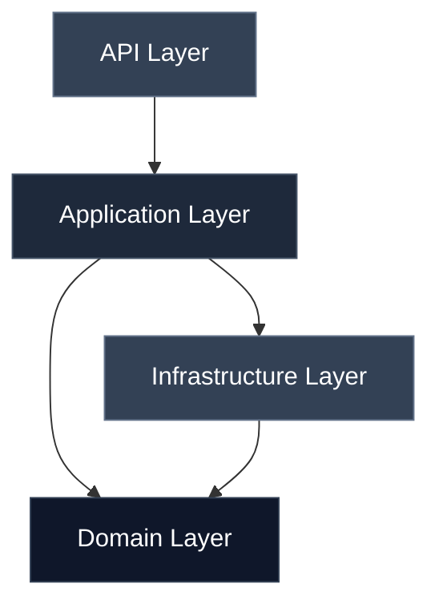
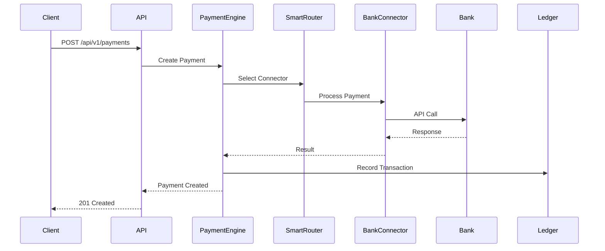
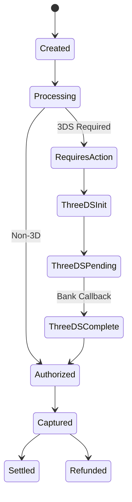

# System Architecture

The Ödeal Payment Infrastructure is built on modern .NET architecture principles with a focus on scalability, reliability, and maintainability.

## Technology Stack

<CardGroup cols={2}>
  <Card title=".NET 10" icon="code">
    Latest .NET runtime for high performance
  </Card>
  <Card title="PostgreSQL" icon="database">
    Robust relational database for transactions
  </Card>
  <Card title="Redis" icon="server">
    Caching and distributed locking
  </Card>
  <Card title="RabbitMQ" icon="rabbit">
    Message queue for async processing
  </Card>
</CardGroup>

## Clean Architecture Layers

The project follows Clean Architecture principles with clear separation of concerns:

### Domain Layer
The core business logic and entities:
- **Entities**: `Merchant`, `Transaction`, `Payment`, `Refund`
- **Value Objects**: `Money`, `CardDetails`, `Address`
- **Domain Events**: `PaymentCreated`, `PaymentCompleted`, `RefundProcessed`
- **Specifications**: Business rules and validation logic

### Application Layer
Use cases and orchestration:
- **Commands**: `CreatePaymentCommand`, `RefundPaymentCommand`
- **Queries**: `GetTransactionQuery`, `GetMerchantQuery`
- **Services**: `PaymentService`, `MerchantService`
- **Validators**: FluentValidation rules

### Infrastructure Layer
External integrations and persistence:
- **Persistence**: Entity Framework Core, PostgreSQL
- **Bank Connectors**: 7 Tier-1 Turkish banks
- **Caching**: Redis
- **Messaging**: RabbitMQ with MassTransit
- **Webhooks**: Svix integration

### API Layer
RESTful endpoints and middleware:
- **Controllers**: Payment, Merchant, Transaction endpoints
- **Middleware**: Authentication, Logging, Exception Handling
- **Versioning**: URL-based API versioning

## Payment Flow Architecture

## Key Components

### Smart Routing Engine

Routes payments to the optimal bank connector based on:
- Bank availability (health checks)
- Success rate (recent history)
- Response latency
- Cost optimization
- Merchant preferences
- Card BIN routing

### Bank Connector Framework

Abstraction layer for bank integrations:
- **IPaymentConnector**: Payment operations
- **IRefundConnector**: Refund operations
- **IVoidConnector**: Cancellation operations
- **Resilience**: Circuit breaker, retry policies

### 3D Secure Flow

State machine for 3D Secure authentication:

### Webhook System

Event-driven notifications using Svix:
- HMAC signature verification
- Automatic retry with exponential backoff
- Dead letter queue for failed deliveries
- Transactional outbox pattern

## Performance Targets

<CardGroup cols={2}>
  <Card title="Uptime">
    **99.997%** availability
  </Card>
  <Card title="Throughput">
    **2000+ TPS** peak capacity
  </Card>
  <Card title="Latency">
    **&lt;500ms** P99 response time
  </Card>
  <Card title="Volume">
    **2M+** daily transactions
  </Card>
</CardGroup>

## Security Architecture

### Encryption
- **At Rest**: AES-256 encryption for sensitive data
- **In Transit**: TLS 1.3 for all communications
- **Card Data**: PCI-DSS compliant handling

### Authentication & Authorization
- API Key + HMAC authentication
- Role-based access control (RBAC)
- Rate limiting per merchant

### Compliance
- **PCI DSS Level 1**: Full compliance
- **GDPR**: Data privacy compliance
- **KVKK**: Turkish data protection law

## Infrastructure

### Database Design
- **Primary**: PostgreSQL with read replicas
- **Caching**: Redis for session and lookup data
- **Migrations**: EF Core migrations

### Message Queue
- **RabbitMQ**: Event-driven architecture
- **MassTransit**: Message bus abstraction
- **Outbox Pattern**: Transactional consistency

### Observability
- **Logging**: Structured logging with Serilog
- **Metrics**: Prometheus exporters
- **Tracing**: Distributed tracing
- **Dashboards**: Grafana visualizations

## Deployment Architecture

Current deployment:
- **Environment**: On-premise Kubernetes
- **Architecture**: Monolith (transitioning to microservices)
- **Orchestration**: Kubernetes with auto-scaling
- **Monitoring**: Prometheus + Grafana stack

Target microservices:
- Payment Service
- Merchant Service
- Reporting Service
- Bank Adapter Service
- Ledger Service

## Integration Points

### External Systems
- **Banks**: 7 Tier-1 Turkish bank APIs
- **Ledger**: Formance integration (planned)
- **Webhooks**: Svix for merchant notifications

### Internal Services
- **Fraud Detection**: Separate domain
- **KYC**: Separate domain
- **Identity/Auth**: Separate domain

## Scalability Strategy

- **Horizontal Scaling**: Stateless API instances
- **Database**: Read replicas and connection pooling
- **Caching**: Multi-layer caching strategy
- **Async Processing**: Background workers for heavy operations
