# Product Vision

## Executive Summary

### Vision
Build Turkey's most reliable, scalable, and developer-friendly virtual POS infrastructure, delivering Stripe/Adyen-level payment experience to all segments from SMEs to enterprise companies.

### Mission

<CardGroup cols={2}>
  <Card title="Uptime" icon="shield-check">
    **99.997%+** uptime for uninterrupted payment service
  </Card>
  <Card title="Capacity" icon="gauge-high">
    **2000+ TPS** capacity for high-volume transactions
  </Card>
  <Card title="Daily Volume" icon="chart-line">
    **2M+** daily transaction capacity
  </Card>
  <Card title="Integration" icon="plug">
    Single integration point for all Turkish banks
  </Card>
</CardGroup>

## Target Audience

<Tabs>
  <Tab title="SME">
    ### Small & Medium Enterprises
    - Small e-commerce sites
    - **Needs**: Simple integration, low cost
    - **Features**: Easy API, quick onboarding, competitive rates
  </Tab>
  
  <Tab title="Marketplace">
    ### Marketplace Platforms
    - Platforms like Trendyol, Hepsiburada
    - **Needs**: Split payment, sub-merchant management
    - **Features**: Recursive merchants, automated splits, individual settlements
  </Tab>
  
  <Tab title="SaaS">
    ### SaaS Companies
    - Subscription-based products
    - **Needs**: Recurring payments, subscription management
    - **Features**: Automated billing, retry logic, webhook notifications
  </Tab>
  
  <Tab title="Enterprise">
    ### Enterprise Companies
    - Large corporations (e.g., Yıldız Holding, Migros, Opet)
    - **Needs**: High volume, custom SLA, multi-entity support
    - **Features**: Dedicated infrastructure, priority support, custom integrations
  </Tab>
</Tabs>

## Competitive Advantage

| Feature | iyzico | Craftgate | **Ödeal Target** |
|---------|--------|-----------|------------------|
| **Uptime** | 99.9% | 99.9% | **99.997%** |
| **Smart Routing** | ✓ | ✓ | **Advanced** |
| **API Quality** | Good | Good | **Stripe-level** |
| **Marketplace** | ✓ | ✓ | **Advanced** |
| **Documentation** | Medium | Good | **Excellent** |

## Business Model

### Payment Facilitator (PayFac) Model

```mermaid
flowchart LR
    Customer[Customer] -->|Payment| Bank[Bank]
    Bank -->|Settlement| Odeal[Ödeal]
    Odeal -->|Distribution| Merchant[Merchant]
    
    style Odeal fill:#0F172A,stroke:#334155,color:#fff
    style Merchant fill:#10B981,stroke:#059669,color:#fff
    style Bank fill:#3B82F6,stroke:#2563EB,color:#fff
```

### Revenue Model

<AccordionGroup>
  <Accordion title="Transaction Commission" icon="percent">
    Percentage-based fees:
    - Single payment: X%
    - Installment: X% + installment fee
    - International card: Higher %
  </Accordion>
  
  <Accordion title="Monthly Subscription" icon="calendar">
    Package-based pricing:
    - Starter: Basic features
    - Professional: Advanced features
    - Enterprise: Custom solutions
  </Accordion>
</AccordionGroup>

<Note>
Commission calculation is managed within this platform, while actual payment/billing is handled externally.
</Note>

## Functional Scope

### MVP Scope (Phase 1)

#### Payment Types
- ✅ **Single Payment**: Standard card payment
- ✅ **Installment**: 2-12 installments
- ✅ **3D Secure**: 3D Pay, 3D Full, 3D Half
- ✅ **Non-Secure**: Non-3DS payment
- ✅ **Pre-auth**: Pre-authorization
- ✅ **Recurring**: Repeating payments
- ✅ **Subscription**: Subscription management
- ✅ **Marketplace**: Marketplace payments
- ✅ **Split Payment**: Payment distribution

#### Transaction Management
- ✅ **Full Refund**: Complete refund
- ✅ **Partial Refund**: Partial refund
- ✅ **Cancel**: Pre-EOD cancellation
- ✅ **Void**: Pre-auth cancellation
- ✅ **Capture**: Pre-auth completion

#### Merchant Management
- ✅ **Merchant CRUD**: Basic merchant operations
- ✅ **Sub-merchant**: Marketplace sub-merchants
- ✅ **Bank Configuration**: Merchant-specific bank settings
- ✅ **Commission Setup**: Merchant-specific rates
- ✅ **Limit Management**: Transaction limits

#### Reporting
- ✅ **Transaction Reports**: Listing & export
- ✅ **Reconciliation**: Bank matching
- ✅ **Financial Reports**: Settlement, commission

#### Multi-Currency
- ✅ **Multi-currency**: USD, EUR acceptance
- ✅ **DCC**: Dynamic Currency Conversion

### Out of Scope

<Warning>
The following features are explicitly **NOT** included in the current scope:
</Warning>

- BKM Express
- Wallet integrations (Garanti Pay, Maximum Mobil, etc.)
- BNPL (Buy Now Pay Later)
- Wire transfer / EFT
- Cryptocurrency payments
- Card tokenization (Phase 2)
- Native Mobile SDK (Phase 2)
- International bank integration
- Admin Dashboard UI (API only)
- Fraud Detection (separate domain)

## Technical Requirements

### Performance Targets

| Metric | Target | Measurement |
|--------|--------|-------------|
| **Uptime** | 99.997% | Monthly |
| **P99 Latency** | <500ms | Real-time |
| **Error Rate** | <0.01% | Daily |
| **TPS Capacity** | 2000+ | Load test |
| **Daily Transactions** | 2M+ | Daily |
| **Monthly Volume** | 15B TRY | Monthly |
| **Merchant Count** | 100,000 | Current |

### Security & Compliance

<CardGroup cols={2}>
  <Card title="PCI DSS" icon="shield">
    Level 1 compliance maintained
  </Card>
  <Card title="GDPR / KVKK" icon="user-shield">
    Full data privacy compliance
  </Card>
  <Card title="Encryption" icon="lock">
    At rest and in transit
  </Card>
  <Card title="Audit" icon="clipboard-check">
    Complete activity tracking
  </Card>
</CardGroup>

## Bank Integration Strategy

### Tier 1 Banks (MVP) ✓ Complete

- Halkbank
- İş Bankası
- Anadolubank
- Akbank
- Denizbank
- Türkiye Finans Katılım Bankası (TFKB)
- Vakıfbank

### Tier 2 Banks (Post-MVP)

- Garanti BBVA
- Yapı Kredi
- QNB Finansbank
- Ziraat Bankası
- TEB
- ING

## Success Metrics

### Technical KPIs

<CardGroup cols={2}>
  <Card title="Uptime SLA" icon="clock">
    99.997% monthly availability
  </Card>
  <Card title="Performance" icon="bolt">
    &lt;500ms P99 latency
  </Card>
  <Card title="Reliability" icon="check">
    &lt;0.01% error rate
  </Card>
  <Card title="Scale" icon="server">
    2M+ daily transactions
  </Card>
</CardGroup>

### Business KPIs

- **Monthly Volume**: 15B TRY current target
- **Merchant Count**: 100,000 supported
- **Bank Coverage**: 100% Turkish banks (12 months)

### Definition of Done (MVP)

- [x] Tier 1 banks integrated (7 banks)
- [x] All payment types working
- [x] 99.997% uptime for 1 month
- [x] 2M daily transactions passing
- [x] Zero duplicate transactions
- [x] Zero calculation errors
- [x] &lt;0.01% fail rate

## Roadmap

### ✅ Phase 0: Foundation (Complete)
Core framework and standards

### ✅ Phase 1: MVP (Complete)
Payment Facilitator core functionality

### ✅ Phase 2: Marketplace (Complete)
Recursive merchants and split payments

### 🔄 Current Focus: Stability & Documentation
- Documentation enhancement
- QA and verification
- Mintlify integration

### 🎯 Next: Global Expansion
- Multi-currency enhancement
- International market preparation

### 🚀 Future: Developer Experience
- Pay by Link UI
- Developer portal
- Mobile SDKs

## Constraints & Assumptions

### Constraints
-  Turkey market only
-  Turkish language only (Phase 1)
-  No card tokenization (Phase 1)
-  No native SDK (Phase 1)
-  API only (no admin UI)

### Assumptions
- BDDK license current and valid
- Bank agreements in place
- PCI-DSS certification will be renewed
- Fraud detection handled in separate domain
- Kubernetes cluster ready with sufficient capacity

### Dependencies
- Formance Ledger (deployment & integration)
- Svix (webhook infrastructure)
- Bank sandbox/test environments
- PCI-DSS audit process
