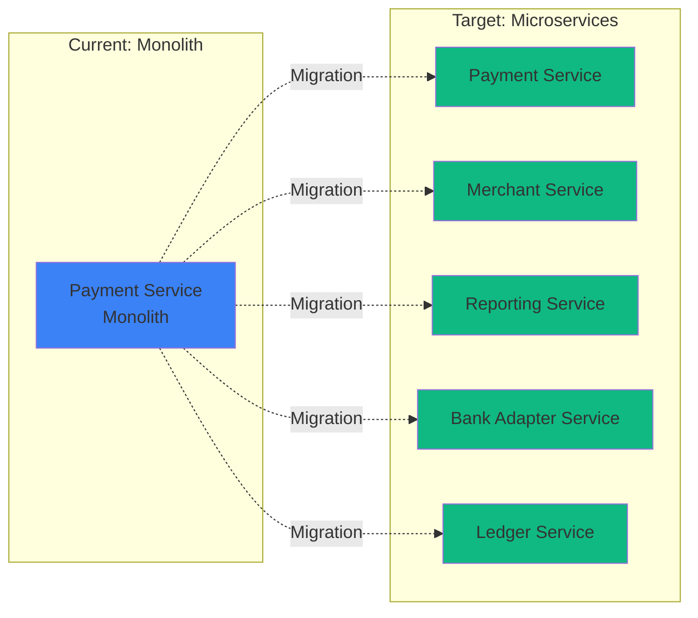

# Project Roadmap

Strategic direction for the Ödeal Payment Infrastructure project from completed milestones to future expansions.

## Current Status: Phase 2 Complete ✅

The project has successfully completed **Phase 2 (Marketplace Expansion)**. All core payment, marketplace, and operational features are live and production-ready.

## Completed Milestones

<Steps>
  <Step title="Phase 0: Foundation ✅">
    Core framework and standards
    - Global exception handling
    - Structured logging with Serilog
    - API versioning
    - Health checks
    - Idempotency middleware
  </Step>
  
  <Step title="Phase 1: MVP (Payment Facilitator) ✅">
    Core payment facilitator functionality
    - Bank integrations (7 Tier-1 banks)
    - Smart routing engine
    - Payment engine (3D & Non-3D)
    - Ledger integration
    - Settlement calculation
  </Step>
  
  <Step title="Phase 2: Marketplace Expansion ✅">
    Marketplace capabilities
    - Recursive sub-merchant onboarding
    - Split payment engine
    - Split refund logic
    - Multi-level commission distribution
  </Step>
</Steps>

---

## Future Roadmap

### Q1 2025: Stability & Documentation 🎯

**Focus**: Verify robustness of Phase 2 features and ensure comprehensive documentation.

<CardGroup cols={2}>
  <Card title="Documentation" icon="book">
    - Sync architectural docs with codebase
    - **Complete Mintlify integration**
    - API reference enhancement
    - Code examples and tutorials
  </Card>
  
  <Card title="QA & Verification" icon="clipboard-check">
    - End-to-end marketplace testing
    - Recursive refund split validation
    - Ledger reconciliation verification
    - Performance benchmarking
  </Card>
</CardGroup>

**Key Deliverables**:
- ✅ Comprehensive Mintlify documentation site
- Integration test suite for complex scenarios
- Load testing results (2000+ TPS validation)
- Security audit report

---

### Q2 2025: Global Expansion 🌍

**Focus**: Prepare infrastructure for international markets.

#### EPIC-21 Enhancement: Multi-Currency Support

<Accordion title="Features" icon="globe">
  - **Central Bank Integration**: Real-time TRY exchange rates
  - **DCC Enhancement**: Improved Dynamic Currency Conversion
  - **Multi-Currency Settlement**: Automated forex handling
  - **Currency Pair Management**: Support for additional currency pairs
</Accordion>

#### International Bank Integration

<Accordion title="Planned Banks" icon="building-columns">
  - **European Banks**: Stripe, Adyen integration
  - **US Banks**: Explore partnerships
  - **Regional Banks**: Target specific markets
</Accordion>

**Success Metrics**:
- Support for 5+ currency pairs
- &lt;100ms DCC calculation latency
- 99.9% forex rate accuracy

---

### Q3 2025: SME & Developer Experience 👨‍💻

**Focus**: Expand product offering to smaller merchants and external developers.

#### EPIC-20 Enhancement: Pay by Link

<Card title="Features" icon="link">
  - Simple UI for creating payment links
  - SMS/Email integration
  - QR code generation
  - Custom branding options
  - Expiration and usage limits
</Card>

#### EPIC-22 Completion: Developer Portal

<Card title="Features" icon="code">
  - Advanced API credentials management
  - Sandbox environment with test cards
  - Comprehensive integration guides
  - Interactive API playground
  - Usage analytics dashboard
</Card>

#### Mobile SDK Development

<CardGroup cols={2}>
  <Card title="Android SDK" icon="android">
    - Native Android integration
    - Kotlin support
    - Material Design UI
  </Card>
  
  <Card title="iOS SDK" icon="apple">
    - Native iOS integration
    - Swift support
    - SwiftUI components
  </Card>
</CardGroup>

**Success Metrics**:
- 1000+ active developer accounts
- 100+ integrated merchants via portal
- &lt;30 min integration time for quickstart

---

### Q4 2025: Advanced Features 🚀

**Focus**: Premium features for enterprise customers.

#### Subscription & Recurring Payments

<Accordion title="Features" icon="repeat">
  - Subscription plan management
  - Automated billing cycles
  - Retry logic for failed payments
  - Proration support
  - Usage-based billing
</Accordion>

#### Advanced Fraud Detection

<Accordion title="Features" icon="shield-halved">
  - Machine learning-based risk scoring
  - Velocity checks
  - Device fingerprinting
  - 3DS challenge rules
  - Custom rule engine
</Accordion>

#### Enhanced Reporting & Analytics

<Accordion title="Features" icon="chart-bar">
  - Real-time analytics dashboard
  - Custom report builder
  - Scheduled reports
  - Data warehouse integration
  - BI tool connectors
</Accordion>

---

## Technology Roadmap

### Microservices Migration

Transition from monolith to microservices:

**Timeline**: Q4 2025 - Q2 2026

### Infrastructure Enhancements

<CardGroup cols={2}>
  <Card title="Kubernetes Optimization" icon="ship">
    - Auto-scaling policies
    - Resource optimization
    - Multi-region deployment
    - Disaster recovery
  </Card>
  
  <Card title="Observability" icon="magnifying-glass-chart">
    - Distributed tracing enhancement
    - APM integration
    - Log aggregation
    - Custom alerting
  </Card>
</CardGroup>

---

## Performance Targets

| Metric | Current | Q2 2025 | Q4 2025 |
|--------|---------|---------|---------|
| **Uptime** | 99.997% | 99.999% | 99.999% |
| **TPS** | 2000+ | 5000+ | 10000+ |
| **P99 Latency** | &lt;500ms | &lt;300ms | &lt;200ms |
| **Daily Volume** | 2M+ | 5M+ | 10M+ |
| **Merchants** | 100K | 250K | 500K |

---

## Risk Mitigation

<Warning>
Key risks and mitigation strategies:
</Warning>

<AccordionGroup>
  <Accordion title="Scalability Challenges" icon="arrow-up-right-dots">
    **Risk**: System unable to handle growth
    
    **Mitigation**:
    - Proactive load testing
    - Gradual microservices migration
    - Database sharding strategy
    - CDN for static assets
  </Accordion>
  
  <Accordion title="Regulatory Changes" icon="scale-balanced">
    **Risk**: New compliance requirements
    
    **Mitigation**:
    - Regular compliance audits
    - Flexible architecture
    - Legal team collaboration
    - Quick adaptation process
  </Accordion>
  
  <Accordion title="Competition" icon="users-gear">
    **Risk**: Market competition intensifies
    
    **Mitigation**:
    - Focus on developer experience
    - Continuous innovation
    - Competitive pricing
    - Superior documentation
  </Accordion>
</AccordionGroup>

---

## Get Involved

<CardGroup cols={2}>
  <Card title="Try it Now" icon="rocket" href="/quickstart">
    Get started with our quick start guide
  </Card>
  
  <Card title="API Reference" icon="code" href="/api-reference/payments">
    Explore our comprehensive API
  </Card>
  
  <Card title="Join Community" icon="users">
    Connect with other developers
  </Card>
  
  <Card title="Contact Sales" icon="envelope">
    Discuss enterprise solutions
  </Card>
</CardGroup>
