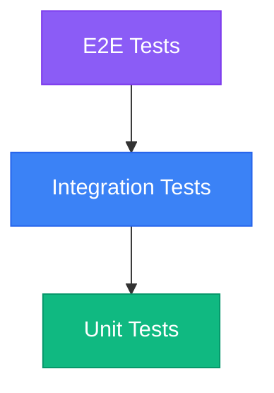

# SDLC Workflow

Our development process follows a structured, role-based SDLC that ensures quality, traceability, and continuous improvement.

## Overview

The SDLC workflow is designed for:
- Predictable delivery with clear exit/entry criteria
- Automated quality gates
- Full traceability from idea to production
- Continuous improvement through feedback loops

## Roles & Responsibilities

### Analyst
**Responsibilities:**
- Requirements discovery and documentation
- Acceptance criteria definition
- Business rules specification
- Alignment with product vision

### Architect
**Responsibilities:**
- Technical design and architecture decisions
- Non-functional requirements (NFRs)
- Architecture Decision Records (ADRs)
- System integration design

### Developer
**Responsibilities:**
- Implementation of features
- Unit and integration tests
- Code reviews
- Documentation updates

### Security Engineer
**Responsibilities:**
- Threat modeling
- Security reviews
- SAST/DAST analysis
- Secrets management

### Release Manager
**Responsibilities:**
- Version management
- Release notes preparation
- Deployment coordination
- Rollback planning

### Code Reviewer
**Responsibilities:**
- Code quality enforcement
- Best practices validation
- Performance review
- Security consideration check

## Epic & Task Structure

### Epic Organization

Epics are organized into phases:

<AccordionGroup>
  <Accordion title="Phase 0: Foundation" icon="foundation">
    Core framework and standards that all features build upon
    - Global exception handling
    - Structured logging
    - API versioning
    - Health checks
  </Accordion>
  
  <Accordion title="Phase 1: MVP (Payment Facilitator)" icon="rocket">
    Core payment facilitator functionality
    - Merchant onboarding
    - Payment processing
    - Bank integrations
    - Transaction lifecycle
  </Accordion>
  
  <Accordion title="Phase 2: Marketplace Expansion" icon="store">
    Marketplace and advanced features
    - Sub-merchant management
    - Split payments
    - Multi-currency support
  </Accordion>
</AccordionGroup>

### Task Lifecycle

Each task goes through structured phases:


## Task Documentation

Each task maintains standardized documentation:

### 01-analysis.md
- Business requirements
- Acceptance criteria
- User stories
- Dependencies

### 02-technical-design.md
- Architecture decisions
- Data models
- API contracts
- Integration points

### 03-implementation.md
- Implementation notes
- Code changes
- Migration scripts
- Configuration updates

### 04-security-review.md
- Threat model
- Security considerations
- Compliance checklist
- Vulnerability assessment

### 05-code-review.md
- Review findings
- Code quality assessment
- Performance considerations
- Best practices validation

### 06-release-notes.md
- Feature summary
- Breaking changes
- Migration guide
- Known issues

### status.md
- Current phase
- Progress tracking
- Blockers
- Next steps

## Quality Gates

### Definition of Ready (DoR)

Before starting implementation:
- [ ] Clear business outcome defined
- [ ] Acceptance criteria documented
- [ ] Dependencies identified
- [ ] Non-functional requirements specified
- [ ] Design notes or ADR created
- [ ] Test strategy outlined

### Definition of Done (DoD)

Before marking task complete:
- [ ] Code merged to main
- [ ] Tests added and passing (≥80% coverage)
- [ ] Security checks passed
- [ ] Documentation updated
- [ ] Deployed to target environment
- [ ] Monitoring configured

## Branching Strategy

We follow trunk-based development:

```
main
├── feature/EPIC-XX-TASK-YYY-short-description
├── bugfix/EPIC-XX-TASK-YYY-fix-description
├── chore/EPIC-XX-TASK-YYY-maintenance
└── hotfix/EPIC-XX-TASK-YYY-urgent-fix
```

### Commit Convention

We use Conventional Commits:

```
feat(payments): add 3DS authentication flow
fix(merchants): correct validation for tax ID
chore(deps): update EF Core to latest version
docs(api): update payment endpoint documentation
```

## CI/CD Pipeline

### Continuous Integration

On every pull request:
1. **Build**: Compile all projects
2. **Format**: Verify code formatting
3. **Test**: Run all tests with coverage
4. **Security**: SAST and secret scanning
5. **Artifact**: Build container images

### Quality Gates

Merge requires:
- ✅ Build succeeds
- ✅ Code formatting verified
- ✅ Tests pass with ≥80% coverage
- ✅ No High/Critical security issues
- ✅ At least 1-2 approvals

### Continuous Deployment

On version tag (vX.Y.Z):
1. Build production artifacts
2. Deploy to staging
3. Run smoke tests
4. Manual approval
5. Deploy to production
6. Monitor metrics

## AI Collaboration

We leverage AI to accelerate development:

<CardGroup cols={2}>
  <Card title="Autonomous SDLC" icon="robot">
    AI agents can autonomously advance tasks through SDLC phases
  </Card>
  <Card title="Documentation Generation" icon="file-lines">
    Auto-generate analysis, design, and implementation docs
  </Card>
  <Card title="Code Review" icon="magnifying-glass">
    AI-assisted code quality checks
  </Card>
  <Card title="Test Generation" icon="flask">
    Automated test case generation
  </Card>
</CardGroup>

### Autonomous Workflow

The `/sdlc` command enables fully autonomous task progression:

1. **Detect Current Phase**: Analyze task artifacts to determine state
2. **Execute Phase Actions**: Generate required documents and code
3. **Validate Quality**: Ensure all criteria met
4. **Advance to Next**: Move to next phase automatically
5. **Loop**: Continue until task reaches DONE state

## Testing Strategy

### Test Pyramid



- **Unit Tests**: Fast, isolated, mock dependencies
- **Integration Tests**: Database, HTTP handlers, external boundaries
- **E2E Tests**: Critical user paths post-deployment

### Coverage Requirements

- ≥80% line coverage for Domain/Application layers
- Critical modules may require higher thresholds
- All public APIs must have tests

## Release Management

### Versioning

We use Semantic Versioning (SemVer):
- **MAJOR**: Breaking changes
- **MINOR**: New features (backward compatible)
- **PATCH**: Bug fixes

### Release Process

1. **Preparation**: Create release notes
2. **Tagging**: Tag version (vX.Y.Z)
3. **Build**: CI builds artifacts
4. **Staging**: Deploy to staging
5. **Validation**: Smoke tests
6. **Production**: Deploy to prod
7. **Monitoring**: Watch metrics

### Hotfix Policy

For urgent production issues:
1. Branch from release tag
2. Apply minimal fix
3. Fast-track review
4. Patch version bump
5. Deploy to production
6. Back-merge to main

## Documentation Standards

All changes must update:
- **Code Documentation**: Inline comments for complex logic
- **API Documentation**: OpenAPI/Swagger specs
- **Architecture Docs**: Design decisions and diagrams
- **User Guides**: Integration and feature guides
- **Mintlify Docs**: Public-facing documentation

## Monitoring & Operations

### Observability Stack

- **Logging**: Serilog with structured logging
- **Metrics**: Prometheus exporters
- **Tracing**: Distributed tracing
- **Dashboards**: Grafana visualizations
- **Alerts**: PagerDuty integration

### Incident Management

1. **Detection**: Automated alerts
2. **Response**: On-call engineer investigation
3. **Mitigation**: Quick fix or rollback
4. **Resolution**: Root cause fix
5. **Post-Mortem**: Document lessons learned

## Continuous Improvement

After each release:
- Sprint retrospective
- Metrics review (velocity, quality, incidents)
- Process improvements
- Knowledge sharing sessions
