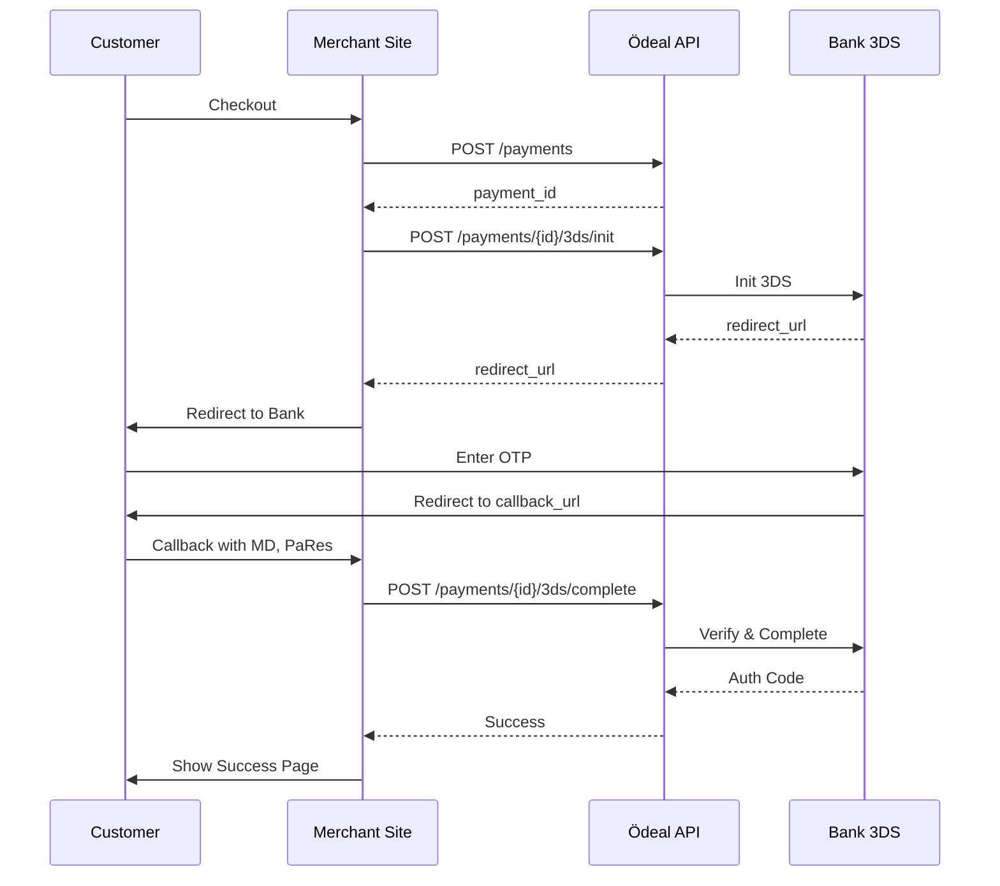

# 3D Secure Integration

Implement secure card authentication using 3D Secure (3DS) protocol for enhanced fraud protection and liability shift.

## What is 3D Secure?

3D Secure is an authentication protocol that adds an extra layer of security for online card payments by verifying the cardholder's identity.

### Benefits

<CardGroup cols={2}>
  <Card title="Liability Shift" icon="shield">
    Fraud liability transfers from merchant to card issuer
  </Card>
  
  <Card title="Reduced Fraud" icon="lock">
    Additional authentication reduces unauthorized transactions
  </Card>
  
  <Card title="Higher Approval" icon="chart-up">
    Banks more likely to approve authenticated transactions
  </Card>
  
  <Card title="Compliance" icon="check">
    Required for SCA (Strong Customer Authentication) in many regions
  </Card>
</CardGroup>

---

## 3D Secure Versions

### 3D Secure 1.0
- Traditional OTP via SMS
- Pop-up based authentication
- Legacy protocol

### 3D Secure 2.0 (Recommended)
- Frictionless authentication for low-risk transactions
- Biometric authentication support
- Better mobile experience
- Risk-based authentication

<Note>
Ödeal supports both 3DS 1.0 and 2.0. Banks automatically use the best available version.
</Note>

---

## Integration Flow

<Steps>
  <Step title="Create Payment">
    Initialize payment with card details
  </Step>
  
  <Step title="Check 3DS Requirement">
    System determines if 3DS is required
  </Step>
  
  <Step title="Initialize 3DS">
    Get authentication URL from bank
  </Step>
  
  <Step title="Redirect Customer">
    Send customer to bank's authentication page
  </Step>
  
  <Step title="Customer Authenticates">
    Customer enters OTP or completes biometric auth
  </Step>
  
  <Step title="Handle Callback">
    Receive authentication result from bank
  </Step>
  
  <Step title="Complete Payment">
    Finalize payment with authentication data
  </Step>
</Steps>

---

## Implementation

### 1. Create Initial Payment

```bash
POST /api/v1/payments
```

```json
{
  "amount": 15000,
  "currency": "TRY",
  "card": {
    "number": "5400619563874511",
    "expiry_month": "12",
    "expiry_year": "2025",
    "cvv": "123",
    "holder_name": "JOHN DOE"
  },
  "requires_3ds": true
}
```

### 2. Initialize 3D Secure

```bash
POST /api/v1/payments/{payment_id}/3ds/init
```

```json
{
  "callback_url": "https://yoursite.com/payment/callback",
  "success_url": "https://yoursite.com/success",
  "failure_url": "https://yoursite.com/failure"
}
```

**Response:**
```json
{
  "redirect_url": "https://bank.com/3ds/auth?session=xyz",
  "session_id": "3ds_abc123",
  "expires_at": "2025-01-15T10:35:00Z"
}
```

### 3. Redirect Customer

```html
<!-- Redirect to bank's 3DS page -->
<script>
  window.location.href = "${redirect_url}";
</script>
```

### 4. Handle Callback

Bank redirects to your `callback_url` with POST data:

```php
// Example PHP callback handler
$md = $_POST['MD'];
$paRes = $_POST['PaRes'];
$status = $_POST['Status'];
```

### 5. Complete Payment

```bash
POST /api/v1/payments/{payment_id}/3ds/complete
```

```json
{
  "md": "base64_md_value",
  "pa_res": "base64_pares_value"
}
```

**Success Response:**
```json
{
  "id": "pay_xyz789",
  "status": "completed",
  "amount": 15000,
  "auth_code": "123456",
  "rrn": "000123456789",
  "threeds_verified": true,
  "eci": "05"
}
```

---

## Sequence Diagram



---

## 3DS Result Codes

### ECI (Electronic Commerce Indicator)

| ECI | 3DS Version | Description |
|-----|-------------|-------------|
| **05** | 3DS 1.0 | Successfully authenticated |
| **02** | 3DS 2.0 | Successfully authenticated |
| **06** | 3DS 1.0 | Attempted authentication |
| **01** | 3DS 2.0 | Attempted authentication |
| **07** | Any | Non-3DS transaction |

<Note>
**ECI 05/02**: Full liability shift
**ECI 06/01**: Partial liability shift
**ECI 07**: No 3DS (merchant liable)
</Note>

---

## Error Scenarios

<AccordionGroup>
  <Accordion title="Customer Cancels Authentication" icon="xmark">
    **Status**: `3ds_cancelled`
    
    **Action**: Show friendly message and allow retry with different payment method
  </Accordion>
  
  <Accordion title="Wrong OTP Entered" icon="lock">
    **Status**: `3ds_failed`
    
    **Action**: Customer can retry authentication (usually 3 attempts allowed)
  </Accordion>
  
  <Accordion title="Timeout" icon="clock">
    **Status**: `3ds_timeout`
    
    **Action**: Session expired after 5 minutes. Create new payment.
  </Accordion>
  
  <Accordion title="Bank System Error" icon="triangle-exclamation">
    **Status**: `3ds_error`
    
    **Action**: Retry or use alternative payment method
  </Accordion>
</AccordionGroup>

---

## Mobile Integration

### In-App Browser

```javascript
// React Native example
import { WebView } from 'react-native-webview';

<WebView
  source={{ uri: redirectUrl }}
  onNavigationStateChange={(navState) => {
    if (navState.url.includes('callback')) {
      // Handle callback
      extractCallbackData(navState.url);
    }
  }}
/>
```

### Deep Linking

For better UX, use deep links for success/failure URLs:

```json
{
  "success_url": "yourapp://payment/success",
  "failure_url": "yourapp://payment/failure"
}
```

---

## Testing

### Test Cards

| Card Number | 3DS | OTP | Result |
|-------------|-----|-----|--------|
| 5400619563874511 | 2.0 | 123456 | Success |
| 4355084355084358 | 1.0 | 123456 | Success |
| 5400619360964581 | No 3DS | - | Success (Non-3D) |

### Sandbox URLs

- Success Callback: `https://sandbox.odeal.com.tr/test/3ds/success`
- Failure Callback: `https://sandbox.odeal.com.tr/test/3ds/failure`

---

## Best Practices

<CardGroup cols={2}>
  <Card title="Always Handle Callbacks" icon="webhook">
    Don't rely on redirect URLs; use webhooks for definitive status
  </Card>
  
  <Card title="Set Reasonable Timeout" icon="clock">
    Default 5-minute timeout is usually sufficient
  </Card>
  
  <Card title="Store Session IDs" icon="database">
    Keep 3DS session IDs for debugging and support
  </Card>
  
  <Card title="Test All Scenarios" icon="flask">
    Test success, failure, cancel, and timeout flows
  </Card>
</CardGroup>

---

## Compliance

<Warning>
  **PSD2/SCA Requirements (Europe)**:
  3DS is mandatory for most online card payments in the EEA under PSD2.
</Warning>

<Note>
  **Turkey**: While not strictly required by regulation, 3DS is strongly recommended and used by virtually all Turkish banks for online transactions.
</Note>

---

## Troubleshooting

| Issue | Solution |
|-------|----------|
| 3DS page not loading | Check callback URLs are HTTPS and publicly accessible |
| Callback not received | Verify callback endpoint accepts POST requests |
| ECI value missing | Contact support; may indicate bank configuration issue |
| Constant timeouts | Check network connectivity; some banks have strict timeout limits |

## API Reference

For complete API documentation:
- [3DS Init](/api-reference/payments#3ds-init)
- [3DS Complete](/api-reference/payments#3ds-complete)
- [3DS Callback](/api-reference/payments#3ds-callback)
