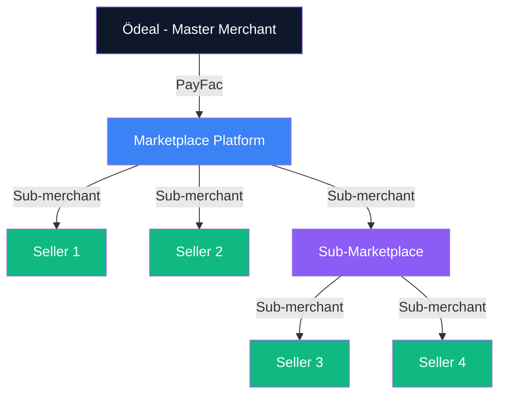

# Marketplace Features

Enable marketplace and platform business models with recursive sub-merchant management and automated split payments.

## Overview

The Ödeal Payment Infrastructure supports the **Payment Facilitator (PayFac) model**, allowing marketplaces to:
- Onboard sellers as sub-merchants
- Process payments on behalf of sub-merchants
- Automatically split and distribute funds
- Manage commission structures

## Use Cases

<CardGroup cols={2}>
  <Card title="E-commerce Marketplace" icon="store">
    Platforms like Trendyol, Hepsiburada with thousands of sellers
  </Card>
  
  <Card title="Service Marketplace" icon="briefcase">
    Platforms connecting service providers (freelancers, contractors)
  </Card>
  
  <Card title="Delivery Platforms" icon="truck">
    Food delivery, grocery delivery platforms
  </Card>
  
  <Card title="Sharing Economy" icon="handshake">
    Rental platforms, ride-sharing services
  </Card>
</CardGroup>

---

## Sub-Merchant Onboarding

### Create Sub-Merchant

```bash
POST /api/v1/merchants/{merchant_id}/sub-merchants
```

```json
{
  "name": "Acme Electronics",
  "tax_id": "1234567890",
  "email": "seller@acme.com",
  "phone": "+905551234567",
  "address": {
    "street": "Atatürk Cad. No:123",
    "city": "Istanbul",
    "postal_code": "34000",
    "country": "TR"
  },
  "bank_account": {
    "iban": "TR320006200011900000012345",
    "account_holder": "Acme Electronics"
  },
  "mcc": "5732",
  "url": "https://acme-shop.com"
}
```

### Response

```json
{
  "id": "sub_xyz789",
  "merchant_id": "mrc_abc123",
  "name": "Acme Electronics",
  "status": "active",
  "sub_merchant_key": "SUB_KEY_789",
  "created_at": "2025-01-15T10:30:00Z"
}
```

---

## Recursive Sub-Merchant Structure

Support for unlimited marketplace hierarchy depth.



<Note>
**Hierarchy Limit**: Default maximum depth is 5 levels. Contact sales for higher limits.
</Note>

---

## Split Payments

Automatically distribute payment amounts among stakeholders.

### Simple Split (2 parties)

```json
{
  "amount": 10000,
  "currency": "TRY",
  "split": [
    {
      "sub_merchant_id": "sub_xyz789",
      "amount": 8500,
      "type": "seller_revenue"
    },
    {
      "sub_merchant_id": "mrc_abc123",
      "amount": 1500,
      "type": "platform_commission"
    }
  ]
}
```

### Complex Split (Multiple parties)

```json
{
  "amount": 10000,
  "currency": "TRY",
  "split": [
    {
      "sub_merchant_id": "sub_seller",
      "amount": 7000,
      "type": "seller_revenue"
    },
    {
      "sub_merchant_id": "sub_logistics",
      "amount": 1500,
      "type": "delivery_fee"
    },
    {
      "sub_merchant_id": "mrc_marketplace",
      "amount": 1000,
      "type": "platform_commission"
    },
    {
      "sub_merchant_id": "mrc_odeal",
      "amount": 500,
      "type": "payment_processing_fee"
    }
  ]
}
```

### Validation Rules

<Warning>
- Sum of split amounts must equal total payment amount
- Each party must be a valid sub-merchant
- Commission rates are validated against merchant agreements
</Warning>

---

## Commission Management

### Commission Models

<Tabs>
  <Tab title="Percentage">
    ### Percentage-based
    ```json
    {
      "commission_type": "percentage",
      "rate": 15.0,  // 15% of transaction
      "min_amount": 100,
      "max_amount": 5000
    }
    ```
  </Tab>
  
  <Tab title="Fixed">
    ### Fixed amount
    ```json
    {
      "commission_type": "fixed",
      "amount": 500  // 5.00 TRY per transaction
    }
    ```
  </Tab>
  
  <Tab title="Tiered">
    ### Tiered rates
    ```json
    {
      "commission_type": "tiered",
      "tiers": [
        { "up_to": 10000, "rate": 20.0 },
        { "up_to": 50000, "rate": 15.0 },
        { "above": 50000, "rate": 10.0 }
      ]
    }
    ```
  </Tab>
</Tabs>

---

## Split Refunds

Refunds are automatically distributed according to the original split.

### Full Refund

```bash
POST /api/v1/payments/{payment_id}/refund
```

Original splits are reversed:
- Seller receives -7000 TRY
- Platform receives -1500 TRY  
- Logistics receives -1500 TRY

### Partial Refund

```json
{
  "amount": 5000,
  "split_proportionally": true
}
```

Refund is split proportionally:
- Seller: -3500 TRY (70% of refund)
- Platform: -750 TRY (15% of refund)
- Logistics: -750 TRY (15% of refund)

---

## Settlement

Individual settlements for each sub-merchant.

### Settlement Schedule

<CardGroup cols={2}>
  <Card title="Daily" icon="calendar-day">
    Automated daily settlements
  </Card>
  <Card title="Manual" icon="hand-pointer">
    On-demand settlement requests
  </Card>
</CardGroup>

### Settlement Report

```bash
GET /api/v1/merchants/{merchant_id}/settlements?date=2025-01-15
```

```json
{
  "date": "2025-01-15",
  "sub_merchants": [
    {
      "sub_merchant_id": "sub_xyz789",
      "gross_revenue": 850000,
      "refunds": -50000,
      "fees": -15000,
      "net_settlement": 785000,
      "currency": "TRY",
      "transaction_count": 245
    }
  ],
  "total_settlement": 785000
}
```

---

## Compliance & KYC

### Required Documentation

<AccordionGroup>
  <Accordion title="Individual Sellers" icon="user">
    - National ID (TCKN)
    - Bank account (IBAN)
    - Contact information
  </Accordion>
  
  <Accordion title="Corporate Sellers" icon="building">
    - Tax ID (VKN)
    - Trade registry document
    - Bank account (IBAN)
    - Authorized signatory information
  </Accordion>
</AccordionGroup>

<Note>
KYC verification is handled outside the payment system. Only approved sub-merchants should be onboarded via API.
</Note>

---

## Best Practices

<CardGroup cols={2}>
  <Card title="Validate Before Onboarding" icon="shield-check">
    Complete KYC before creating sub-merchant
  </Card>
  
  <Card title="Use Webhooks" icon="webhook">
    Monitor settlement events via webhooks
  </Card>
  
  <Card title="Cache Sub-Merchant Data" icon="database">
    Reduce API calls by caching merchant info
  </Card>
  
  <Card title="Test Split Logic" icon="flask">
    Thoroughly test split calculations in sandbox
  </Card>
</CardGroup>

## API Reference

For complete API documentation:
- [Sub-Merchant API](/api-reference/merchants#sub-merchants)
- [Split Payment API](/api-reference/payments#split-payments)
- [Settlement API](/api-reference/settlements)
