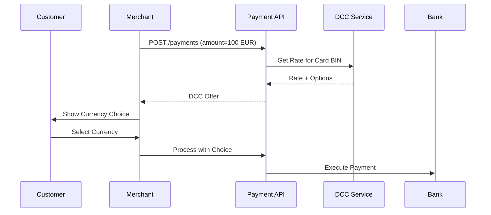

# Multi-Currency Support

Process payments in multiple currencies with automatic conversion and competitive exchange rates.

## Supported Currencies

<CardGroup cols={3}>
  <Card title="TRY" icon="turkish-lira-sign">
    **Turkish Lira** (Primary)
  </Card>
  <Card title="USD" icon="dollar-sign">
    **US Dollar**
  </Card>
  <Card title="EUR" icon="euro-sign">
    **Euro**
  </Card>
</CardGroup>

## Currency Types

### Primary Currency (TRY)
- Default settlement currency
- Direct bank processing
- Lowest fees

### Foreign Currency (USD & EUR)
- Automatic conversion to TRY
- Real-time exchange rates
- DCC option available

---

## Making a Multi-Currency Payment

### Request Example (USD)

```json
{
  "amount": 100,
  "currency": "USD",
  "card": {
    "number": "4355084355084358",
    "expiry_month": "12",
    "expiry_year": "2025",
    "cvv": "123"
  }
}
```

### Response

```json
{
  "id": "pay_abc123",
  "amount": 100,
  "currency": "USD",
  "settlement_amount": 3450,
  "settlement_currency": "TRY",
  "exchange_rate": 34.50,
  "status": "completed"
}
```

---

## Dynamic Currency Conversion (DCC)

DCC allows cardholders to see the transaction amount in their card's currency at the point of sale.

### Benefits

<Accordion title="For Merchants" icon="store">
  - Additional revenue from conversion fees
  - Transparent pricing for customers
  - Reduced chargebacks (customer knows exact amount)
</Accordion>

<Accordion title="For Customers" icon="user">
  - See exact amount in familiar currency
  - No surprise fees on statement
  - Choose between card currency or merchant currency
</Accordion>

### DCC Flow



### DCC Request

```json
{
  "amount": 100,
  "currency": "EUR",
  "card_bin": "540061",
  "enable_dcc": true
}
```

### DCC Response

```json
{
  "dcc_available": true,
  "original_amount": 100,
  "original_currency": "EUR",
  "dcc_amount": 110,
  "dcc_currency": "USD",
  "exchange_rate": 1.10,
  "markup_percentage": 2.5,
  "card_currency": "USD"
}
```

---

## Exchange Rate Management

### Rate Sources

<CardGroup cols={2}>
  <Card title="Central Bank" icon="landmark">
    Turkish Central Bank (TCMB) official rates
  </Card>
  <Card title="Real-time" icon="clock">
    Updated every 15 minutes
  </Card>
</CardGroup>

### Get Current Rates

```bash
GET /api/v1/exchange-rates?from=USD&to=TRY
```

```json
{
  "from_currency": "USD",
  "to_currency": "TRY",
  "rate": 34.50,
  "updated_at": "2025-01-15T10:30:00Z",
  "source": "TCMB"
}
```

---

## Settlement

### Multi-Currency Settlement

Merchants can choose settlement currency:

| Transaction Currency | Settlement Options |
|---------------------|-------------------|
| TRY | TRY only |
| USD | TRY (default) or USD |
| EUR | TRY (default) or EUR |

<Warning>
Foreign currency settlement requires additional bank agreements
</Warning>

### Settlement Report Example

```json
{
  "date": "2025-01-15",
  "transactions": [
    {
      "transaction_id": "trx_123",
      "amount": 100,
      "currency": "USD",
      "settlement_amount": 3450,
      "settlement_currency": "TRY",
      "rate": 34.50,
      "fee": 50,
      "net_amount": 3400
    }
  ],
  "total_settlement": 3400,
  "settlement_currency": "TRY"
}
```

---

## Pricing

### Commission Rates

| Currency | Rate | Notes |
|----------|------|-------|
| TRY | 1.99% | Standard rate |
| USD | 2.49% | Includes conversion |
| EUR | 2.49% | Includes conversion |

### DCC Markup

- Standard markup: 2.5% over TCMB rate
- Merchant receives portion of markup
- Configurable per merchant agreement

---

## Testing

### Test Amounts

Use these amounts for testing different scenarios:

| Amount | Currency | Result |
|--------|----------|--------|
| 10 | USD | Success |
| 20 | EUR | Success |
| 5000 | USD | Limit exceeded |
| 0.50 | EUR | Below minimum |

### Test Exchange Rates

In sandbox, rates are fixed:
- USD/TRY: 34.50
- EUR/TRY: 37.25

---

## Best Practices

<CardGroup cols={2}>
  <Card title="Display All Currencies" icon="language">
    Show amount in both transaction and settlement currency
  </Card>
  
  <Card title="Cache Rates" icon="database">
    Cache exchange rates for 15 minutes
  </Card>
  
  <Card title="Use DCC Wisely" icon="hand-holding-dollar">
    Offer DCC for international cards only
  </Card>
  
  <Card title="Monitor Rates" icon="chart-line">
    Track exchange rate fluctuations
  </Card>
</CardGroup>

## Compliance

<Note>
- All forex transactions comply with Turkish Central Bank regulations
- Merchant must have proper licensing for foreign currency acceptance
- DCC rates must be clearly disclosed to customers
</Note>

## API Reference

For complete API documentation, see:
- [Payment API](/api-reference/payments)
- [Exchange Rate API](/api-reference/exchange-rates)
