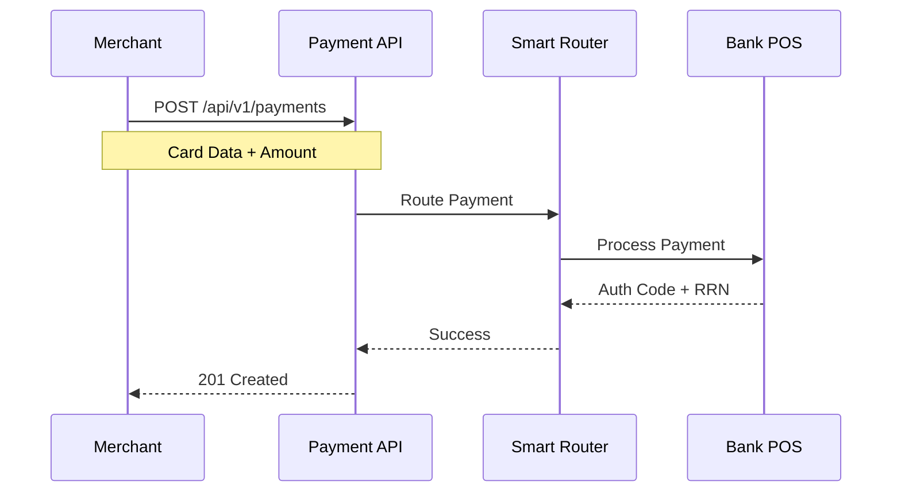
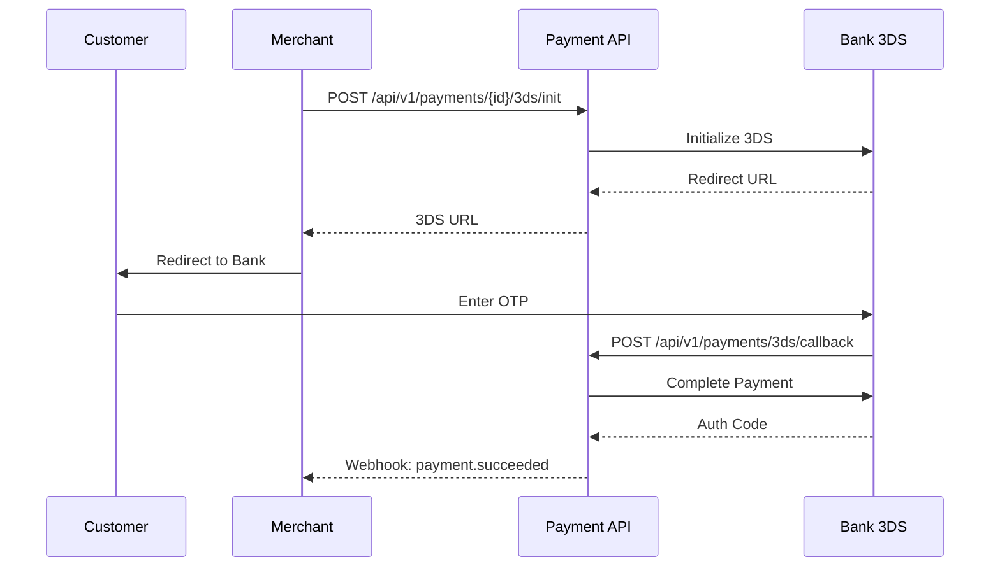
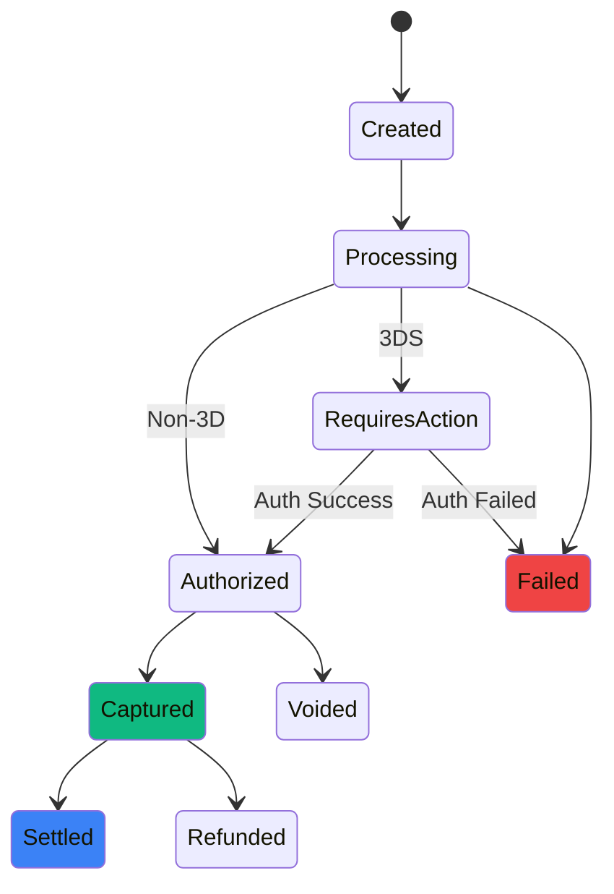

# Payment Flows

Learn how to implement different payment flows including Non-3D and 3D Secure payments.

## Non-3D Payment Flow

Direct payment processing without 3D Secure authentication. Faster but higher risk.

### Flow Diagram



### Request Example

```json
{
  "amount": 15000,
  "currency": "TRY",
  "card": {
    "number": "5400619360964581",
    "expiry_month": "12",
    "expiry_year": "2025",
    "cvv": "123",
    "holder_name": "JOHN DOE"
  },
  "merchant_id": "mrc_abc123",
  "idempotency_key": "uuid-v4-here"
}
```

<Note>
Always include `idempotency_key` to prevent duplicate charges
</Note>

### Response Example

```json
{
  "id": "pay_xyz789",
  "status": "completed",
  "amount": 15000,
  "currency": "TRY",
  "auth_code": "123456",
  "rrn": "000123456789",
  "created_at": "2025-01-15T10:30:00Z"
}
```

---

## 3D Secure Payment Flow

Secure payment with customer authentication. Required for most online transactions in Turkey.

### Flow Diagram



### Implementation Steps

<Steps>
  <Step title="Create Payment">
    Create initial payment record
    ```bash
    POST /api/v1/payments
    ```
  </Step>
  
  <Step title="Initialize 3DS">
    Get 3D Secure redirect URL
    ```bash
    POST /api/v1/payments/{id}/3ds/init
    ```
  </Step>
  
  <Step title="Redirect Customer">
    Send customer to bank's 3DS page for authentication
  </Step>
  
  <Step title="Handle Callback">
    Bank redirects back to your callback URL with authentication result
  </Step>
  
  <Step title="Complete Payment">
    Finalize payment with 3DS data
    ```bash
    POST /api/v1/payments/{id}/3ds/complete
    ```
  </Step>
</Steps>

### 3DS Init Request

```json
{
  "callback_url": "https://yoursite.com/payment/callback",
  "success_url": "https://yoursite.com/payment/success",
  "failure_url": "https://yoursite.com/payment/failure"
}
```

### 3DS Init Response

```json
{
  "redirect_url": "https://bank.com/3ds?sessionid=xyz",
  "session_id": "3ds_session_abc123",
  "expires_at": "2025-01-15T10:35:00Z"
}
```

---

## Pre-Authorization

Hold funds without immediate capture. Useful for hotels, car rentals, etc.

### Pre-Auth Request

```json
{
  "amount": 50000,
  "currency": "TRY",
  "operation_type": "PRE_AUTH",
  "card": { ... }
}
```

### Capture Later

```bash
POST /api/v1/payments/{id}/capture
```

```json
{
  "amount": 45000  // Can be less than pre-auth amount
}
```

---

## Refunds

### Full Refund

```bash
POST /api/v1/payments/{id}/refund
```

```json
{
  "amount": 15000,  // Full amount
  "reason": "Customer request"
}
```

### Partial Refund

```json
{
  "amount": 5000,  // Partial amount
  "reason": "Item returned"
}
```

<Warning>
Sum of partial refunds cannot exceed original payment amount
</Warning>

---

## Void/Cancel

Cancel payment before end-of-day settlement.

```bash
POST /api/v1/payments/{id}/cancel
```

<Note>
Void only works before bank's end-of-day cutoff (typically 23:00 local time)
</Note>

---

## Payment States



## Best Practices

<CardGroup cols={2}>
  <Card title="Always Use Idempotency" icon="shield">
    Prevent duplicate charges with unique idempotency keys
  </Card>
  
  <Card title="Handle Webhooks" icon="webhook">
    Don't rely solely on API responses; use webhooks for final status
  </Card>
  
  <Card title="Validate Card Local" icon="check">
    Pre-validate card numbers client-side to reduce errors
  </Card>
  
  <Card title="Store Minimal Data" icon="database">
    Never store full card numbers; use tokens or references
  </Card>
</CardGroup>

## Error Handling

Common error scenarios:

| Error Code | Description | Action |
|------------|-------------|--------|
| `INSUFFICIENT_FUNDS` | Not enough balance | Ask customer to use different card |
| `INVALID_CARD` | Card number invalid | Verify card details |
| `3DS_FAILED` | Authentication failed | Customer entered wrong OTP |
| `LIMIT_EXCEEDED` | Amount exceeds limit | Reduce amount or contact bank |
| `EXPIRED_CARD` | Card expired | Use valid card |

## Testing

Use test cards in sandbox environment:

| Card Number | 3DS | Result |
|-------------|-----|--------|
| 5400619360964581 | No | Success |
| 5400619563874511 | Yes | Success |
| 4355084355084358 | No | Fail |

<Card title="Sandbox Environment" icon="flask">
  Use `https://sandbox-api.odeal.com.tr/v1` for testing
</Card>
