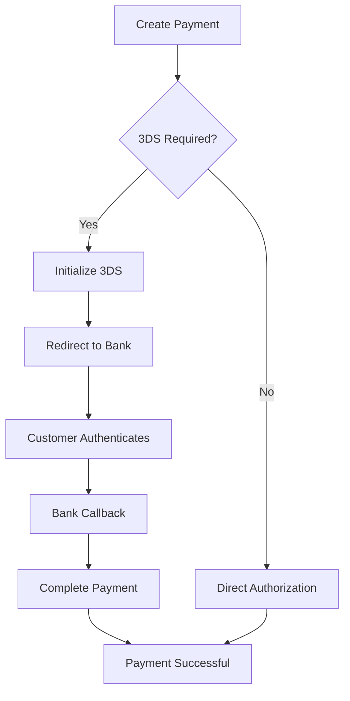

# 3D Secure Integration

3D Secure (3DS) adds an additional layer of security to card payments by requiring cardholder authentication. This guide covers the complete implementation.

## Why Use 3D Secure?

<CardGroup cols={2}>
  <Card title="Reduced Fraud" icon="shield-halved">
    Significantly lower fraud rates and chargebacks
  </Card>
  <Card title="Liability Shift" icon="scale-balanced">
    Shift liability from merchant to card issuer
  </Card>
  <Card title="Higher Acceptance" icon="check">
    Many banks require 3DS for international transactions
  </Card>
  <Card title="Customer Trust" icon="user-shield">
    Customers feel more secure with authentication
  </Card>
</CardGroup>

## 3DS Flow Overview



## Implementation Steps

### Step 1: Create Payment with 3DS

```json
POST /v1/payments
{
  "merchantId": "{{merchantId}}",
  "amount": {
    "amount": 250.00,
    "currency": "TRY"
  },
  "cardDetails": {
    "cardNumber": "5555444433332222",
    "cardHolderName": "JOHN DOE",
    "expiryMonth": "12",
    "expiryYear": "2025",
    "cvv": "123"
  },
  "operationType": "SALE",
  "installments": 1,
  "threeDSecure": true,
  "callbackUrl": "https://yoursite.com/3ds-callback",
  "description": "Order #12345"
}
```

<Note>
The `callbackUrl` is where users will be redirected after completing bank authentication.
</Note>

### Step 2: Initialize 3DS Flow

```bash
POST /v1/payments/{transactionId}/3ds/init
{
  "callbackUrl": "https://yoursite.com/3ds-callback",
  "failureUrl": "https://yoursite.com/payment-failed"
}
```

**Response:**

```json
{
  "redirectUrl": "https://bank.com/3ds/auth?session=xxx",
  "threeDSessionId": "3ds-session-123",
  "expiresAt": "2025-01-15T10:30:00Z"
}
```

### Step 3: Redirect Customer

Redirect the customer to the `redirectUrl` for bank authentication:

<CodeGroup>
```html JavaScript Redirect
<script>
  window.location.href = response.redirectUrl;
</script>
```

```html Form Submission
<form id="3dsForm" method="POST" action="{{ response.redirectUrl }}">
  <input type="hidden" name="session" value="{{ response.threeDSessionId }}" />
</form>
<script>
  document.getElementById('3dsForm').submit();
</script>
```

```python Python (Server-Side)
from flask import redirect

@app.route('/initiate-3ds')
def initiate_3ds():
    response = odeal_api.init_3ds(transaction_id)
    return redirect(response['redirectUrl'])
```
</CodeGroup>

### Step 4: Handle Bank Callback

The bank will redirect back to your `callbackUrl` with 3DS result parameters:

```python
@app.route('/3ds-callback', methods=['POST'])
def handle_3ds_callback():
    transaction_id = request.form.get('transactionId')
    status = request.form.get('status')
    
    if status == 'ThreeDCompleted':
        # 3DS authentication successful
        # Proceed to complete payment
        complete_payment(transaction_id)
    else:
        # 3DS authentication failed
        show_error_page()
```

### Step 5: Complete Payment

After successful 3DS authentication, complete the payment:

```bash
POST /v1/payments/{transactionId}/3ds/complete
```

**Response:**

```json
{
  "transactionId": "550e8400-e29b-41d4-a716-446655440000",
  "status": "Completed",
  "amount": {
    "amount": 250.00,
    "currency": "TRY"
  },
  "threeDSecure": {
    "authenticated": true,
    "eci": "05",
    "cavv": "AAABCZIhcQAAAABZlyFxAAAAAAA=",
    "xid": "ODUzNTYzOTcwODU1NzExODM="
  }
}
```

## Error Handling

<AccordionGroup>
  <Accordion title="Customer Cancels Authentication">
    **Scenario**: Customer closes the browser or clicks "Cancel" during 3DS
    
    **Handling**:
    - Transaction status remains `ThreeDInitiated`
    - Implement timeout handling (typically 5-10 minutes)
    - Show appropriate message to customer
  </Accordion>

  <Accordion title="Authentication Timeout">
    **Scenario**: 3DS session expires
    
    **Handling**:
    - Monitor `expiresAt` timestamp
    - Auto-cancel transaction after expiry
    - Allow customer to retry payment
  </Accordion>

  <Accordion title="Bank System Error">
    **Scenario**: Bank's 3DS system is unavailable
    
    **Handling**:
    - Check `status` in callback
    - Log error details
    - Offer fallback payment method or retry
  </Accordion>
</AccordionGroup>

## 3DS Data Points

After successful 3DS authentication, you'll receive these security indicators:

| Field | Description |
|-------|-------------|
| `eci` | Electronic Commerce Indicator (05 = full authentication) |
| `cavv` | Cardholder Authentication Verification Value |
| `xid` | Transaction identifier |
| `authenticated` | Boolean indicating successful authentication |

## Best Practices

<Steps>
  <Step title="Always Validate Callbacks">
    Verify the callback originates from Ödeal before completing payment
  </Step>
  
  <Step title="Implement Timeouts">
    Set reasonable timeouts (5-10 minutes) for 3DS flows
  </Step>
  
  <Step title="Mobile-Friendly Design">
    Ensure 3DS pages work well on mobile devices
  </Step>
  
  <Step title="Clear Instructions">
    Guide customers through the 3DS process with clear messaging
  </Step>
  
  <Step title="Test Thoroughly">
    Test all scenarios: success, failure, timeout, cancellation
  </Step>
</Steps>

## Testing 3DS

Use these test scenarios:

<CodeGroup>
```bash Successful Authentication
Card: 4111111111111111
OTP: 123456 (in test environment)
```

```bash Failed Authentication  
Card: 4111111111112222
OTP: 000000 (triggers failure)
```

```bash Timeout Simulation
Card: 4111111111113333
(Wait 5+ minutes without completing)
```
</CodeGroup>

## Common Issues

<Warning>
**Issue**: Callback never received

**Solutions**:
- Verify `callbackUrl` is publicly accessible
- Check firewall/security settings
- Ensure HTTPS is enabled
- Validate URL format
</Warning>

<Warning>
**Issue**: Payment stuck in `ThreeDInitiated`

**Solutions**:
- Call complete endpoint after successful callback
- Implement automatic timeout handling
- Check webhook events for status updates
</Warning>

## Next Steps

<CardGroup cols={2}>
  <Card title="Implement Webhooks" href="/essentials/webhooks">
    Get real-time notifications for all 3DS events
  </Card>
  <Card title="Error Handling" href="/essentials/errors">
    Learn about error codes and recovery strategies
  </Card>
</CardGroup>
