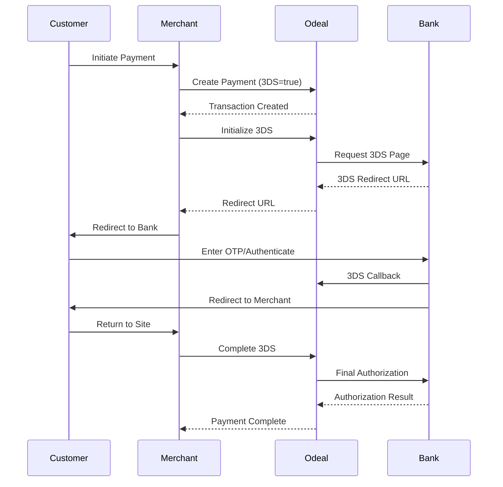

# Payment Flows

Learn how to integrate payment processing into your application using Ödeal Payment Infrastructure.

## Non-3D Secure Payment Flow

The simplest payment flow without 3D Secure authentication.

<Steps>
  <Step title="Create Payment">
    Send a payment request with card details
    
    ```bash
    POST /v1/payments
    ```
  </Step>
  
  <Step title="Receive Response">
    Get immediate authorization result
    
    ```json
    {
      "transactionId": "550e8400-e29b-41d4-a716-446655440000",
      "status": "Completed",
      "amount": { "amount": 100.00, "currency": "TRY" }
    }
    ```
  </Step>
  
  <Step title="Handle Webhook">
    Receive webhook notification for transaction status
  </Step>
</Steps>

### Example Request

```json
{
  "merchantId": "{{merchantId}}",
  "amount": {
    "amount": 100.00,
    "currency": "TRY"
  },
  "cardDetails": {
    "cardNumber": "5555444433332222",
    "cardHolderName": "JOHN DOE",
    "expiryMonth": "12",
    "expiryYear": "2025",
    "cvv": "123"
  },
  "operationType": "SALE",
  "installments": 1,
  "threeDSecure": false,
  "description": "Order #12345"
}
```

## 3D Secure Payment Flow

Recommended for enhanced security and reduced chargeback risk.

<Steps>
  <Step title="Create Payment">
    Create payment with `threeDSecure: true`
  </Step>
  
  <Step title="Initialize 3DS">
    Call 3DS init endpoint to get redirect URL
    
    ```bash
    POST /v1/payments/{id}/3ds/init
    ```
  </Step>
  
  <Step title="Redirect Customer">
    Redirect customer to bank's 3DS page
  </Step>
  
  <Step title="Handle Callback">
    Bank redirects back to your callback URL
  </Step>
  
  <Step title="Complete Payment">
    Complete the payment
    
    ```bash
    POST /v1/payments/{id}/3ds/complete
    ```
  </Step>
</Steps>

### Sequence Diagram



## Pre-Authorization Flow

Hold funds without immediately capturing them.

<Steps>
  <Step title="Create Pre-Auth">
    Set `operationType: "PRE_AUTH"`
  </Step>
  
  <Step title="Authorize Funds">
    Funds are held on customer's card
  </Step>
  
  <Step title="Capture or Void">
    Later, capture the funds or void the authorization
    
    ```bash
    # Capture
    POST /v1/payments/{id}/capture
    
    # Void
    POST /v1/payments/{id}/void
    ```
  </Step>
</Steps>

<Info>
Pre-authorizations are valid for 7 days. After that, they automatically expire.
</Info>

## Installment Payments

Offer flexible installment options to your customers.

### Getting Available Installments

```bash
GET /v1/installments?binNumber=555544&amount=1000
```

### Response

```json
{
  "installmentOptions": [
    {
      "installmentCount": 1,
      "perInstallmentAmount": 1000.00,
      "totalAmount": 1000.00,
      "commissionRate": 0
    },
    {
      "installmentCount": 3,
      "perInstallmentAmount": 340.00,
      "totalAmount": 1020.00,
      "commissionRate": 2.0
    }
  ]
}
```

## Refund Flow

Process full or partial refunds.

<CodeGroup>
```bash Full Refund
POST /v1/payments/{id}/refund
Content-Type: application/json

{
  "reason": "Product returned"
}
```

```bash Partial Refund  
POST /v1/payments/{id}/refund
Content-Type: application/json

{
  "amount": {
    "amount": 50.00,
    "currency": "TRY"
  },
  "reason": "Partial product return"
}
```
</CodeGroup>

<Warning>
Multiple partial refunds are allowed, but the total cannot exceed the original payment amount.
</Warning>

## Best Practices

<CardGroup cols={2}>
  <Card title="Always Use 3DS" icon="shield">
    3D Secure significantly reduces fraud and chargebacks
  </Card>
  <Card title="Implement Webhooks" icon="bell">
    Don't rely solely on API responses for payment status
  </Card>
  <Card title="Handle All States" icon="list-check">
    Implement handlers for all possible transaction states
  </Card>
  <Card title="Use Idempotency" icon="repeat">
    Always include idempotency keys to prevent duplicate charges
  </Card>
</CardGroup>

## Payment States

| State | Description | Next Actions |
|-------|-------------|--------------|
| `Pending` | Payment created, awaiting processing | Wait for completion |
| `ThreeDInitiated` | 3DS flow started | Customer authentication required |
| `ThreeDCompleted` | 3DS successful | Complete payment |
| `Authorized` | Funds authorized (pre-auth) | Capture or void |
| `Completed` | Payment successful | Refund if needed |
| `Failed` | Payment failed | Retry or inform customer |
| `Voided` | Transaction cancelled | No further action |
| `Refunded` | Fully refunded | No further action |
| `PartiallyRefunded` | Partially refunded | Additional refunds possible |

## Testing

Use these test card numbers for testing different scenarios:

| Card Number | Brand | Scenario |
|-------------|-------|----------|
| `5555444433332222` | Mastercard | Successful payment |
| `4111111111111111` | Visa | Successful payment |
| `5555444433331111` | Mastercard | Insufficient funds |
| `4111111111112222` | Visa | 3DS authentication required |

<Note>
Test cards only work with your test API key (`test_sk_...`)
</Note>
