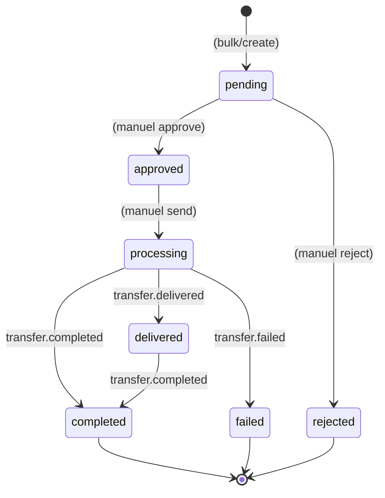

Para Transferi şu anda **3 olay tipi** yayınlar. Subscription oluştururken `events[]` dizisinde dinlemek istediklerinizi belirtirsiniz.

## Genel yapı

Olay tipi ve teslimat metadata'sı **HTTP header'larında** taşınır; gövde olayın kendisidir
(**düz/flat** JSON — ayrıca bir `data` zarfı yoktur):

| Header | Açıklama |
|---|---|
| `X-Payven-Event` | Olay tipi (`transfer.completed`, `transfer.delivered`, `transfer.failed`) |
| `X-Payven-Event-Id` | Olay kimliği — idempotency için kullanın. **Aynı olay birden fazla kez gönderilebilir** ama event id aynıdır. |
| `X-Payven-Delivery-Id` | Bu teslimat denemesinin kimliği (retry'da değişir) |
| `X-Payven-Signature` | `sha256=<hex>` HMAC imzası — bkz. [İmza Doğrulama](/para-transferi/webhooks/overview#imza) |
| `X-Payven-Timestamp` | İmza zaman damgası (Unix saniye) |

## Payload ortak alanları

Tüm olaylar aynı gövde şemasını kullanır:

| Alan | Açıklama |
|---|---|
| `event_type` | Olay tipi (header'daki `X-Payven-Event` ile aynı) |
| `transfer_id` | Transferin Payven kimliği (UUID) |
| `tenant_id` | Tenant kimliği |
| `merchant_id` | Transferin merchant kimliği (UUID, opsiyonel) |
| `external_merchant_id` | Merchant'ın dış (string) kimliği |
| `status` | Transfer mevcut durumu (snake_case string) |
| `amount` | Tutar (kuruş) |
| `currency` | Para birimi (`"try"`) |
| `external_id` | Sizin sisteminizdeki transfer kimliği |
| `description` | Transfer açıklaması |
| `message` | Banka/konnektör mesajı (özellikle hatada anlamlı) |
| `receipt_no` | Makbuz numarası (başarıda dolu) |
| `occurred_at` | Olayın gerçekleşme zamanı (+03:00 Türkiye saati) |

## Olay tipleri

### `transfer.completed`

**Tetikleyici:** Banka transferi **senkron** onayladı — terminal başarı.

```json
{
  "event_type":           "transfer.completed",
  "transfer_id":          "8e3f5c12-9a7b-4c8d-bc4e-2c963f66afa6",
  "tenant_id":            "11111111-1111-1111-1111-111111111111",
  "merchant_id":          "3fa85f64-5717-4562-b3fc-2c963f66afa6",
  "external_merchant_id": "MRCH-001",
  "status":               "completed",
  "amount":               1500000,
  "currency":             "try",
  "external_id":          "PAYROLL-001",
  "description":          "Mayıs maaş ödemesi",
  "message":              "Transfer başarılı",
  "receipt_no":           "TRF-20260503-0001",
  "occurred_at":          "2026-05-03T15:34:58.123+03:00"
}
```

`receipt_no` makbuz numarasını saklayın — sonradan dekont indirme akışında kullanırsınız.

### `transfer.delivered`

**Tetikleyici:** Banka transferi **asenkron** kabul etti (örn. FAST) — Payven tarafında
başarı sayılır; banka kesinleştirme bildirimi gelirse durum `completed`'a ilerler.

Payload şeması `transfer.completed` ile aynıdır; `status` alanı `delivered` gelir.

### `transfer.failed`

**Tetikleyici:** Banka reddi, teknik hata veya konnektör sağlık sorunu — terminal başarısızlık.

```json
{
  "event_type":           "transfer.failed",
  "transfer_id":          "8e3f5c12-9a7b-4c8d-bc4e-2c963f66afa6",
  "tenant_id":            "11111111-1111-1111-1111-111111111111",
  "merchant_id":          "3fa85f64-5717-4562-b3fc-2c963f66afa6",
  "external_merchant_id": "MRCH-001",
  "status":               "failed",
  "amount":               1500000,
  "currency":             "try",
  "external_id":          "PAYROLL-001",
  "description":          "Mayıs maaş ödemesi",
  "message":              "Kaynak hesapta yeterli bakiye yok",
  "receipt_no":           null,
  "occurred_at":          "2026-05-03T15:34:58.123+03:00"
}
```

Hata detayı `message` alanındadır; hata kodu eşlemesi için [Hata Kodları](/para-transferi/errors/overview).

## Olay → Transfer durumu eşleşmesi



Oluşturma (`bulk/create`), onay (`approve`) ve gönderim (`send`) adımları webhook olayı
yayınlamaz — bunlar **operatör eylemleri** olduğu için konsol audit log'una düşer. Webhook
yalnızca bankaya gönderim sonrası **terminal sonuçlarda** tetiklenir.

## Webhook subscription örneği

```bash
curl -X POST https://transfer.payven.com.tr/api/v1/webhooks \
  -H "Authorization: Bearer $PAYVEN_TOKEN" \
  -H "Content-Type: application/json" \
  -d '{
    "url":    "https://example.com/webhooks/payven-transfers",
    "events": ["transfer.completed", "transfer.delivered", "transfer.failed"]
  }'
```

## Yol haritası

İleride eklenmesi planlanan olaylar:

- `transfer.created` / `transfer.approved` / `transfer.sent` — yaşam döngüsünün operasyonel adımları
- `transfer.refunded` — alıcı tarafından iade edildiğinde
- `recurring.transfer.scheduled` — tekrarlayan transfer üretildiğinde

Güncellemeler için: [Changelog](/resources/changelog).
