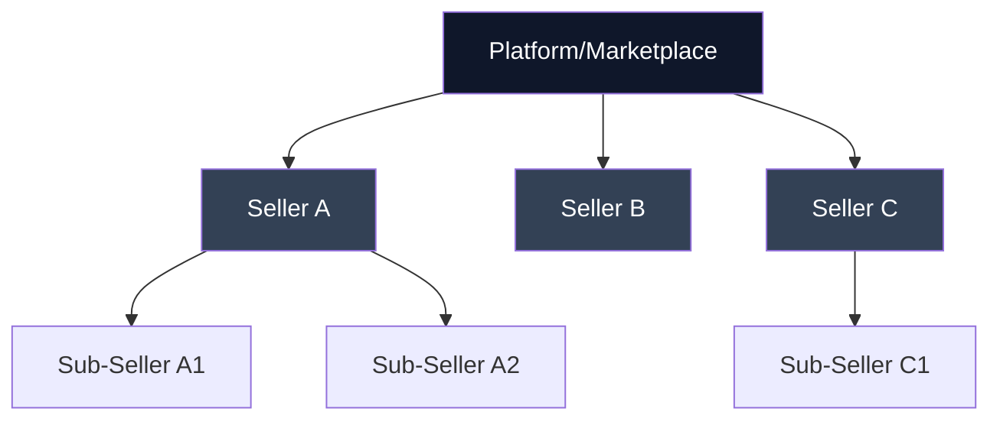

# Marketplace & Platform Integration

Enable your marketplace or platform to accept payments on behalf of multiple sellers with automated commission splits, compliance management, and flexible payout structures.

## Overview

Ödeal's Payment Facilitator model is specifically designed for marketplaces and platforms:

<CardGroup cols={2}>
  <Card title="Recursive Sub-Merchants" icon="sitemap">
    Unlimited hierarchy depth for complex marketplace structures
  </Card>
  <Card title="Automated Splits" icon="split">
    Automatic fund distribution to platform and sellers
  </Card>
  <Card title="Flexible Commissions" icon="percent">
    Percentage or fixed fee commission structures
  </Card>
  <Card title="Individual Payouts" icon="money-bill-transfer">
    Separate settlement for each merchant
  </Card>
</CardGroup>

## Marketplace Architecture



## Quick Start

### 1. Onboard Sub-Merchants

Register sellers on your platform:

<CodeGroup>

```javascript JavaScript
const merchant = await fetch('https://api.odeal.com/v1/merchants', {
  method: 'POST',
  headers: {
    'Authorization': 'Bearer YOUR_API_KEY',
    'Content-Type': 'application/json'
  },
  body: JSON.stringify({
    name: 'Artisan Coffee Shop',
    email: 'contact@artisancoffee.com',
    type: 'SUB_MERCHANT',
    parentMerchantId: 'your-platform-merchant-id',
    businessInfo: {
      legalName: 'Artisan Coffee Ltd.',
      taxId: '1234567890',
      businessType: 'LIMITED_COMPANY'
    },
    contactInfo: {
      phone: '+905551234567',
      address: {
        country: 'TR',
        city: 'Istanbul',
        postalCode: '34000',
        line1: 'Kadıköy Moda Street 45'
      }
    },
    bankAccount: {
      accountNumber: 'TR330006100519786457841326',
      accountHolderName: 'Artisan Coffee Ltd.'
    },
    commissionConfig: {
      platformCommissionRate: 0.15, // 15%
      platformFixedFee: 0.50 // 0.50 TRY per transaction
    }
  })
});

console.log('Merchant created:', merchant.id);
```

```python Python
merchant = requests.post(
    'https://api.odeal.com/v1/merchants',
    headers={
        'Authorization': 'Bearer YOUR_API_KEY',
        'Content-Type': 'application/json'
    },
    json={
        'name': 'Artisan Coffee Shop',
        'email': 'contact@artisancoffee.com',
        'type': 'SUB_MERCHANT',
        'parentMerchantId': 'your-platform-merchant-id',
        'businessInfo': {
            'legalName': 'Artisan Coffee Ltd.',
            'taxId': '1234567890',
            'businessType': 'LIMITED_COMPANY'
        },
        'contactInfo': {
            'phone': '+905551234567',
            'address': {
                'country': 'TR',
                'city': 'Istanbul',
                'postalCode': '34000',
                'line1': 'Kadıköy Moda Street 45'
            }
        },
        'bankAccount': {
            'accountNumber': 'TR330006100519786457841326',
            'accountHolderName': 'Artisan Coffee Ltd.'
        },
        'commissionConfig': {
            'platformCommissionRate': 0.15,
            'platformFixedFee': 0.50
        }
    }
).json()
```

</CodeGroup>

### 2. Create Payment with Split

Process a payment with automatic commission split:

```javascript
const payment = await fetch('https://api.odeal.com/v1/payments', {
  method: 'POST',
  headers: {
    'Authorization': 'Bearer YOUR_API_KEY',
    'Content-Type': 'application/json'
  },
  body: JSON.stringify({
    merchantId: 'seller-merchant-id', // The seller's merchant ID
    amount: 250.00,
    currency: 'TRY',
    orderId: 'marketplace-order-12345',
    description: 'Handmade ceramic mug',
    splitPayment: {
      enabled: true,
      splits: [
        {
          merchantId: 'platform-merchant-id',
          amount: 37.50, // 15% platform commission
          description: 'Platform commission'
        },
        {
          merchantId: 'seller-merchant-id',
          amount: 212.50, // 85% to seller
          description: 'Seller payment'
        }
      ]
    }
  })
});
```

### 3. Multi-Item Cart with Multiple Sellers

Handle shopping carts with items from different sellers:

```javascript
// Cart with items from 3 different sellers
const cartItems = [
  { sellerId: 'seller-A', amount: 100.00, description: 'Coffee beans' },
  { sellerId: 'seller-B', amount: 50.00, description: 'Tea set' },
  { sellerId: 'seller-A', amount: 75.00, description: 'Grinder' }
];

// Group by seller and calculate totals
const sellerTotals = groupBySeller(cartItems);

// Create separate payment for each seller
for (const [sellerId, items] of Object.entries(sellerTotals)) {
  const total = items.reduce((sum, item) => sum + item.amount, 0);
  const platformFee = total * 0.15;
  const sellerAmount = total - platformFee;
  
  await createPayment({
    merchantId: sellerId,
    amount: total,
    currency: 'TRY',
    orderId: `order-12345-${sellerId}`,
    splitPayment: {
      enabled: true,
      splits: [
        { merchantId: 'platform-id', amount: platformFee },
        { merchantId: sellerId, amount: sellerAmount }
      ]
    }
  });
}
```

## Advanced Features

### Dynamic Commission Rates

Set different commission rates per seller or category:

```javascript
// Premium seller - lower commission
const premiumSellerPayment = {
  merchantId: 'premium-seller-id',
  amount: 500.00,
  splitPayment: {
    splits: [
      { merchantId: 'platform-id', amount: 25.00 }, // 5% commission
      { merchantId: 'premium-seller-id', amount: 475.00 }
    ]
  }
};

// New seller - higher commission
const newSellerPayment = {
  merchantId: 'new-seller-id',
  amount: 500.00,
  splitPayment: {
    splits: [
      { merchantId: 'platform-id', amount: 100.00 }, // 20% commission
      { merchantId: 'new-seller-id', amount: 400.00 }
    ]
  }
};
```

### Nested Marketplaces

Support white-label marketplace solutions:

```javascript
// Main Platform -> Regional Platform -> Local Seller
const payment = {
  merchantId: 'local-seller-id',
  amount: 1000.00,
  splitPayment: {
    splits: [
      { 
        merchantId: 'main-platform-id', 
        amount: 50.00, // 5% main platform fee
        description: 'Main platform commission'
      },
      { 
        merchantId: 'regional-platform-id', 
        amount: 100.00, // 10% regional platform fee
        description: 'Regional platform commission'
      },
      { 
        merchantId: 'local-seller-id', 
        amount: 850.00, // 85% to seller
        description: 'Seller payment'
      }
    ]
  }
};
```

### Escrow & Delayed Settlement

Hold funds until order completion:

```javascript
// Create payment with preauth
const payment = await createPayment({
  merchantId: 'seller-id',
  amount: 300.00,
  captureMethod: 'MANUAL', // Don't capture immediately
  description: 'Custom artwork order'
});

// Later, when order is completed...
await capturePayment(payment.id, {
  splitPayment: {
    enabled: true,
    splits: [
      { merchantId: 'platform-id', amount: 45.00 },
      { merchantId: 'seller-id', amount: 255.00 }
    ]
  }
});
```

## Seller Dashboard Integration

Provide sellers with transaction visibility:

```javascript
// Get transactions for a specific seller
app.get('/api/seller/:sellerId/transactions', async (req, res) => {
  const transactions = await fetch(
    `https://api.odeal.com/v1/transactions?merchantId=${req.params.sellerId}`,
    {
      headers: { 'Authorization': `Bearer ${YOUR_API_KEY}` }
    }
  );
  
  res.json(transactions);
});

// Get settlement summary
app.get('/api/seller/:sellerId/settlements', async (req, res) => {
  const settlements = await fetch(
    `https://api.odeal.com/v1/settlements?merchantId=${req.params.sellerId}`,
    {
      headers: { 'Authorization': `Bearer ${YOUR_API_KEY}` }
    }
  );
  
  res.json(settlements);
});
```

## Compliance & KYC

Collect required business information:

```javascript
async function onboardSeller(sellerData) {
  // Step 1: Validate business information
  const kycValidation = await validateBusinessInfo(sellerData);
  
  if (!kycValidation.valid) {
    throw new Error('Invalid business information');
  }
  
  // Step 2: Upload required documents
  const documents = await uploadDocuments({
    taxCertificate: sellerData.taxCertificate,
    identityDocument: sellerData.identityDocument,
    bankStatement: sellerData.bankStatement
  });
  
  // Step 3: Create merchant
  const merchant = await createMerchant({
    ...sellerData,
    documentIds: documents.map(d => d.id),
    kycStatus: 'PENDING_REVIEW'
  });
  
  return merchant;
}
```

## Refund Handling

Manage refunds across split payments:

```javascript
// Full refund - reverses all splits
await refundPayment({
  paymentId: 'payment-123',
  amount: 250.00, // Full amount
  reason: 'Customer requested refund'
});
// Platform commission and seller payment both refunded

// Partial refund
await refundPayment({
  paymentId: 'payment-123',
  amount: 125.00, // Half amount
  reason: 'Partial order cancellation',
  splitRefund: true // Maintain split proportions
});
// Refunds split proportionally between platform and seller
```

## Webhooks for Marketplace Events

Listen for marketplace-specific events:

```javascript
app.post('/webhooks/marketplace', (req, res) => {
  const event = req.body;
  
  switch (event.type) {
    case 'merchant.created':
      await notifyPlatformAdmin(event.data.merchant);
      break;
      
    case 'merchant.verified':
      await enableSellerStorefront(event.data.merchantId);
      break;
      
    case 'settlement.completed':
      await notifySeller(event.data.merchantId, 'funds_transferred');
      break;
      
    case 'split_payment.succeeded':
      await updatePlatformRevenue(event.data.splits);
      break;
  }
  
  res.status(200).send('OK');
});
```

## Best Practices

<AccordionGroup>
  <Accordion title="Gradual Onboarding">
    Start with simplified onboarding and collect additional info over time:
    
    ```javascript
    // Initial registration - minimal info
    const merchant = await createBasicMerchant({
      email: seller.email,
      name: seller.businessName
    });
    
    // Later - complete KYC
    await updateMerchantKYC(merchant.id, {
      taxId: seller.taxId,
      documents: seller.documents
    });
    ```
  </Accordion>
  
  <Accordion title="Commission Transparency">
    Clearly show commission breakdown to sellers:
    
    ```javascript
    const breakdown = {
      subtotal: 250.00,
      platformCommission: -37.50,
      paymentProcessingFee: -5.00,
      sellerPayout: 207.50
    };
    ```
  </Accordion>
  
  <Accordion title="Settlement Schedule">
    Communicate clear payout timing:
    
    - Daily settlements for high-volume sellers
    - Weekly settlements for new sellers
    - Immediate for trusted partners
  </Accordion>
  
  <Accordion title="Dispute Management">
    Implement clear dispute resolution process:
    
    ```javascript
    async function handleDispute(disputeId) {
      // Hold settlement until resolved
      await pauseSettlement(disputeId);
      
      // Notify relevant parties
      await notifyParties(disputeId);
      
      // After resolution
      await resumeSettlement(disputeId);
    }
    ```
  </Accordion>
</AccordionGroup>

## Next Steps

<CardGroup cols={2}>
  <Card title="Split Payments" icon="split" href="/features/split-payments">
    Deep dive into split payment configurations
  </Card>
  <Card title="Merchant API" icon="users" href="/api-reference/merchants">
    Complete merchant management API
  </Card>
  <Card title="Webhooks" icon="webhook" href="/guides/webhooks">
    Set up event notifications
  </Card>
  <Card title="Testing" icon="flask" href="/guides/testing">
    Test marketplace flows
  </Card>
</CardGroup>
