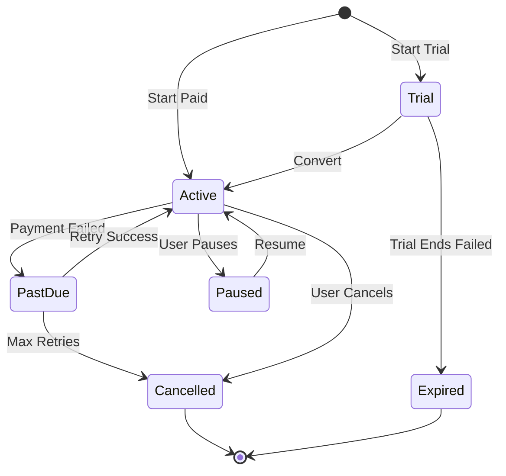

# Subscription & Recurring Payments

Implement flexible subscription billing for your SaaS, membership, or service business with automated recurring charges, dunning management, and upgrade/downgrade flows.

## Overview

<CardGroup cols={2}>
  <Card title="Flexible Billing" icon="calendar">
    Daily, weekly, monthly, yearly billing cycles
  </Card>
  <Card title="Auto-Retry" icon="arrows-rotate">
    Smart dunning logic for failed payments
  </Card>
  <Card title="Prorated Upgrades" icon="arrow-up-right-dots">
    Automatic proration for plan changes
  </Card>
  <Card title="Trial Periods" icon="hourglass-start">
    Free trials with automatic conversion
  </Card>
</CardGroup>

## Coming Soon

<Note>
  Subscription features are currently in development. This guide shows the planned implementation approach using our existing payment infrastructure.
</Note>

Full subscription support will include:
- Automated recurring billing
- Subscription lifecycle management
- Usage-based billing
- Metered billing support
- Customer portal

## Current Implementation

While native subscription support is coming soon, you can implement recurring billing using our payment API:

### 1. Store Customer Payment Method

```javascript
// Create payment with card storage
const setup = await fetch('https://api.odeal.com/v1/payments', {
  method: 'POST',
  headers: {
    'Authorization': 'Bearer YOUR_API_KEY',
    'Content-Type': 'application/json'
  },
  body: JSON.stringify({
    merchantId: 'your-merchant-id',
    amount: 0.50, // Small verification amount
    currency: 'TRY',
    customerId: 'customer-123',
    saveCard: true,
    description: 'Card verification for subscription'
  })
});

const { cardToken } = setup;
// Store cardToken securely in your database
```

### 2. Schedule Recurring Charges

```javascript
// Your scheduled job (runs daily)
async function processSubscriptionBillings() {
  const dueSubscriptions = await db.subscriptions.find({
    nextBillingDate: { $lte: new Date() },
    status: 'ACTIVE'
  });
  
  for (const subscription of dueSubscriptions) {
    try {
      const payment = await chargeSubscription(subscription);
      
      if (payment.status === 'SUCCEEDED') {
        await updateSubscription(subscription.id, {
          lastBillingDate: new Date(),
          nextBillingDate: calculateNextBilling(subscription.interval),
          status: 'ACTIVE'
        });
      }
    } catch (error) {
      await handleFailedBilling(subscription, error);
    }
  }
}

async function chargeSubscription(subscription) {
  return await fetch('https://api.odeal.com/v1/payments', {
    method: 'POST',
    headers: {
      'Authorization': 'Bearer YOUR_API_KEY',
      'Content-Type': 'application/json'
    },
    body: JSON.stringify({
      merchantId: subscription.merchantId,
      amount: subscription.amount,
      currency: subscription.currency,
      customerId: subscription.customerId,
      cardToken: subscription.cardToken, // Use stored card
      description: `Subscription billing - ${subscription.planName}`,
      orderId: `sub-${subscription.id}-${Date.now()}`
    })
  });
}
```

### 3. Dunning Management

Handle failed payment retries:

```javascript
async function handleFailedBilling(subscription, error) {
  const attempt = subscription.failedAttempts || 0;
  
  if (attempt < 3) {
    // Schedule retry
    const retryDate = calculateRetryDate(attempt);
    
    await db.subscriptions.update(subscription.id, {
      failedAttempts: attempt + 1,
      nextRetryDate: retryDate,
      status: 'PAST_DUE'
    });
    
    // Notify customer
    await sendEmail(subscription.customerEmail, {
      template: 'payment_failed',
      retryDate: retryDate
    });
  } else {
    // Max retries reached - cancel subscription
    await db.subscriptions.update(subscription.id, {
      status: 'CANCELLED',
      cancelledAt: new Date(),
      cancellationReason: 'PAYMENT_FAILED'
    });
    
    await sendEmail(subscription.customerEmail, {
      template: 'subscription_cancelled'
    });
  }
}

function calculateRetryDate(attemptNumber) {
  // Retry schedule: 3 days, 7 days, 14 days
  const days = [3, 7, 14][attemptNumber];
  return new Date(Date.now() + days * 24 * 60 * 60 * 1000);
}
```

### 4. Plan Upgrades/Downgrades

```javascript
async function changePlan(subscriptionId, newPlan) {
  const subscription = await db.subscriptions.findById(subscriptionId);
  const oldPlan = await db.plans.findById(subscription.planId);
  
  // Calculate prorated amount
  const daysRemaining = calculateDaysRemaining(subscription.nextBillingDate);
  const daysInCycle = calculateTotalDays(subscription.interval);
  const unusedCredit = (oldPlan.price / daysInCycle) * daysRemaining;
  const newChargeToday = Math.max(0, newPlan.price - unusedCredit);
  
  if (newChargeToday > 0) {
    // Charge the prorated difference immediately
    const payment = await chargeProration({
      subscriptionId,
      amount: newChargeToday,
      description: `Upgrade to ${newPlan.name}`
    });
    
    if (payment.status !== 'SUCCEEDED') {
      throw new Error('Upgrade payment failed');
    }
  }
  
  // Update subscription
  await db.subscriptions.update(subscriptionId, {
    planId: newPlan.id,
    amount: newPlan.price,
    upgradedAt: new Date()
  });
  
  return { success: true, charged: newChargeToday };
}
```

### 5. Free Trial Implementation

```javascript
async function createTrialSubscription(customer, plan) {
  const trialEndDate = new Date();
  trialEndDate.setDate(trialEndDate.getDate() + plan.trialDays);
  
  const subscription = await db.subscriptions.create({
    customerId: customer.id,
    planId: plan.id,
    status: 'TRIAL',
    trialEndDate: trialEndDate,
    nextBillingDate: trialEndDate,
    amount: plan.price,
    currency: plan.currency
  });
  
  // Schedule reminder emails
  await scheduleTrialReminders(subscription, {
    oneDayBefore: true,
    threeDaysBefore: true,
    oneWeekBefore: true
  });
  
  return subscription;
}

// Convert trial to paid
async function convertTrial(subscriptionId) {
  const subscription = await db.subscriptions.findById(subscriptionId);
  
  if (new Date() >= subscription.trialEndDate) {
    const payment = await chargeSubscription(subscription);
    
    if (payment.status === 'SUCCEEDED') {
      await db.subscriptions.update(subscriptionId, {
        status: 'ACTIVE',
        convertedAt: new Date(),
        nextBillingDate: calculateNextBilling(subscription.interval)
      });
    } else {
      await db.subscriptions.update(subscriptionId, {
        status: 'TRIAL_EXPIRED',
        expiredAt: new Date()
      });
    }
  }
}
```

## Subscription Lifecycle



## Pricing Models

### Fixed Pricing

```javascript
const plans = {
  basic: {
    name: 'Basic',
    price: 99.00,
    interval: 'MONTHLY',
    features: ['Feature A', 'Feature B']
  },
  pro: {
    name: 'Pro',
    price: 299.00,
    interval: 'MONTHLY',
    features: ['Feature A', 'Feature B', 'Feature C', 'Feature D']
  }
};
```

### Tiered Pricing

```javascript
const plan = {
  name: 'Usage Based',
  basePrice: 49.00,
  tiers: [
    { upTo: 1000, pricePerUnit: 0.10 },
    { upTo: 5000, pricePerUnit: 0.08 },
    { upTo: Infinity, pricePerUnit: 0.05 }
  ]
};

function calculateUsageBilling(usage) {
  let cost = plan.basePrice;
  let remaining = usage;
  
  for (const tier of plan.tiers) {
    const unitsInTier = Math.min(remaining, tier.upTo);
    cost += unitsInTier * tier.pricePerUnit;
    remaining -= unitsInTier;
    
    if (remaining <= 0) break;
  }
  
  return cost;
}
```

### Per-Seat Pricing

```javascript
async function addSeat(subscriptionId) {
  const subscription = await db.subscriptions.findById(subscriptionId);
  const newSeatCount = subscription.seats + 1;
  const pricePerSeat = subscription.plan.pricePerSeat;
  
  // Prorate for current billing cycle
  const daysRemaining = calculateDaysRemaining(subscription.nextBillingDate);
  const daysInCycle = calculateTotalDays(subscription.interval);
  const proratedCharge = (pricePerSeat / daysInCycle) * daysRemaining;
  
  // Charge prorated amount
  await chargeProration({
    subscriptionId,
    amount: proratedCharge,
    description: 'Added seat'
  });
  
  // Update subscription
  await db.subscriptions.update(subscriptionId, {
    seats: newSeatCount,
    amount: pricePerSeat * newSeatCount
  });
}
```

## Customer Portal

Self-service subscription management:

```javascript
// API endpoints for customer portal
app.get('/api/customer/:customerId/subscription', async (req, res) => {
  const subscription = await db.subscriptions.findOne({
    customerId: req.params.customerId,
    status: { $in: ['ACTIVE', 'TRIAL', 'PAST_DUE'] }
  });
  
  res.json(subscription);
});

app.post('/api/customer/:customerId/subscription/cancel', async (req, res) => {
  const subscription = await cancelSubscription(req.params.customerId, {
    reason: req.body.reason,
    feedback: req.body.feedback,
    effectiveDate: req.body.immediately ? 'NOW' : 'END_OF_CYCLE'
  });
  
  res.json(subscription);
});

app.post('/api/customer/:customerId/subscription/pause', async (req, res) => {
  const subscription = await pauseSubscription(req.params.customerId, {
    pauseUntil: req.body.resumeDate
  });
  
  res.json(subscription);
});

app.put('/api/customer/:customerId/card', async (req, res) => {
  const updated = await updatePaymentMethod(
    req.params.customerId,
    req.body.cardToken
  );
  
  res.json(updated);
});
```

## Analytics & Metrics

Track key subscription metrics:

```javascript
async function getSubscriptionMetrics(merchantId) {
  const subscriptions = await db.subscriptions.find({ merchantId });
  
  return {
    mrr: calculateMRR(subscriptions), // Monthly Recurring Revenue
    arr: calculateARR(subscriptions), // Annual Recurring Revenue
    churnRate: calculateChurnRate(subscriptions),
    ltv: calculateLifetimeValue(subscriptions),
    activeSubscriptions: subscriptions.filter(s => s.status === 'ACTIVE').length,
    trialConversionrate: calculateTrialConversion(subscriptions),
    avgRevenuePerUser: calculateARPU(subscriptions)
  };
}
```

## Best Practices

<AccordionGroup>
  <Accordion title="Grace Period">
    Give customers time to fix payment issues:
    
    ```javascript
    const gracePeriodDays = 7;
    const subscription = {
      status: 'PAST_DUE',
      accessUntil: new Date(Date.now() + gracePeriodDays * 24 * 60 * 60 * 1000)
    };
    ```
  </Accordion>
  
  <Accordion title="Clear Communication">
    Send timely notifications:
    - 7 days before renewal
    - On renewal day
    - When payment fails
    - Before cancellation
  </Accordion>
  
  <Accordion title="Easy Cancellation">
    Make it easy to cancel (reduces frustration):
    
    ```javascript
    // Offer pause instead of cancel
    if (cancellationRequest) {
      offerPauseOption();
      offerDowngradeOption();
    }
    ```
  </Accordion>
  
  <Accordion title="Proration Accuracy">
    Always prorate plan changes fairly:
    
    ```javascript
    const unusedDays = daysRemaining;
    const unusedCredit = (currentPlan.price / totalDays) * unusedDays;
    const amountDue = newPlan.price - unusedCredit;
    ```
  </Accordion>
</AccordionGroup>

## Next Steps

<CardGroup cols={2}>
  <Card title="Save Cards" icon="credit-card" href="/features/payment-flows">
    Learn about card tokenization
  </Card>
  <Card title="Webhooks" icon="webhook" href="/guides/webhooks">
    Set up subscription event notifications
  </Card>
  <Card title="Testing" icon="flask" href="/guides/testing">
    Test subscription flows
  </Card>
  <Card title="API Reference" icon="code" href="/api-reference/payments">
    Payment API documentation
  </Card>
</CardGroup>
